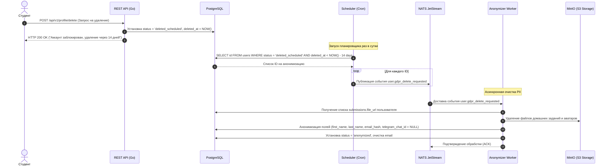

# GDPR Compliance: Проектирование воркера анонимизации (Right to be Forgotten)

Соблюдение требований регламента **GDPR (General Data Protection Regulation)** является стандартом защиты приватности пользователей. Одно из главных требований — **Right to be Forgotten (Право на забвение)**: пользователь имеет право потребовать полного удаления своих персональных данных (PII — Personally Identifiable Information).

Однако в сложных аналитических системах (каковой является LMS) жесткое удаление строк через `DELETE` приводит к каскадному разрушению связей в БД и ломает бизнес-метрики.

---

## 1. Проблема жесткого удаления (`DELETE`)

Если выполнить запрос `DELETE FROM users WHERE id = 'user_uuid'`, произойдет одно из двух:
1.  **Каскадное удаление (ON DELETE CASCADE):** Удалятся все домашние работы студента (`submissions`), отзывы кураторов (`reviews`) и история прохождения (`lesson_progress`).
    *   *Последствие:* Аналитика школы полностью сломается. Вы больше не будете знать реальное число студентов, средний балл за поток, а кураторы потеряют историю своей работы.
2.  **Запрет удаления (RESTRICT):** СУБД вернет ошибку внешнего ключа (Foreign Key Constraint).
    *   *Последствие:* Удалить пользователя будет технически невозможно без удаления всей цепочки его действий вручную.

---

## 2. Архитектурное решение: Двухфазное удаление (Grace Period + Delayed Anonymization)

Прямое и мгновенное удаление персональных данных несет высокие риски:
1. **Случайное удаление:** Если пользователь кликнул по кнопке по ошибке, восстановить его прогресс, ДЗ и историю оценок будет физически невозможно.
2. **Борьба с фродом:** Злоумышленник может совершить деструктивные действия (например, спамить в комментариях или украсть контент) и тут же мгновенно удалиться, чтобы скрыть следы.
3. **Финансовый аудит:** Согласно законам ЕС (например, налоговым требованиям), финансовые транзакции и факты оказания услуг должны храниться определенный период (часто от 5 до 10 лет), что временно перекрывает требования GDPR на немедленное удаление.

Поэтому мы проектируем **двухфазный пайплайн удаления**:

* **Фаза 1 (Синхронная / Мгновенная): Мгновенная блокировка (Grace Period).**
  При запросе на удаление статус пользователя в БД меняется на `deleted_scheduled`, устанавливается отметка `deleted_at = NOW()`, а все его активные сессии инвалидируются в Redis. Вход на платформу блокируется. При этом все файлы в S3 и данные в БД остаются нетронутыми. У пользователя есть 14 или 30 дней (период охлаждения), чтобы восстановить аккаунт через службу поддержки.

* **Фаза 2 (Асинхронная / Отложенная): Окончательная анонимизация (Hard Purge).**
  Планировщик (cron-воркер) раз в сутки сканирует БД на наличие пользователей в статусе `deleted_scheduled`, у которых `deleted_at` наступил более 14/30 дней назад. Для каждого такого пользователя планировщик публикует событие `user.gdpr_delete_requested` в NATS JetStream, запуская процесс физического удаления файлов из S3 и затирания PII-данных в БД.

### Схема жизненного цикла процесса удаления:



---

## 3. Пошаговый алгоритм работы воркера анонимизации (Фаза 2)

При получении события `user.gdpr_delete_requested` от планировщика запускается следующий пайплайн:

### Шаг 3.1: Анонимизация email
Мы не можем оставить email в открытом виде. Но нам нужно предотвратить повторную регистрацию под этим же email (если это бизнес-требование платформы) или гарантировать, что один и тот же человек не сможет бесконечно злоупотреблять пробным периодом.
*   **Решение:** Мы заменяем реальный email на криптографический односторонний хэш с солью (Salted SHA-256).
*   **Код на Go (концепт):**
    ```go
    func HashEmail(email string, salt string) string {
        hasher := hmac.New(sha256.New, []byte(salt))
        hasher.Write([]byte(strings.ToLower(strings.TrimSpace(email))))
        return hex.EncodeToString(hasher.Sum(nil))
    }
    ```
*   Поле `email` в базе данных затирается (`NULL` или пустая строка `""`), а поле `email_hash` сохраняет уникальный хэш. При попытке новой регистрации система проверяет наличие хэша в БД.

### Шаг 3.2: Затирание текстовых PII-данных
Поля, содержащие имя и фамилию пользователя, перезаписываются сгенерированными случайными значениями.
*   `first_name` $\rightarrow$ `"Anonymized"`
*   `last_name` $\rightarrow$ `"#Student_2984"` (случайный ID)
*   `password_hash` $\rightarrow$ `"invalidated_by_gdpr_request_" + uuid.New().String()` (вход под аккаунтом становится физически невозможен).
*   `status` $\rightarrow$ `"anonymized"`.

### Шаг 3.3: Физическое удаление файлов из S3/MinIO
Студент за время учебы загружает PDF-отчеты, архивы с кодом, изображения. Эти файлы хранятся в MinIO и содержат личные данные (например, имя в титульном листе или метаданные файлов).
*   Воркер делает запрос в базу данных:
    ```sql
    SELECT file_url FROM submissions WHERE student_id = $1 AND file_url IS NOT NULL;
    ```
*   Для каждого найденного `file_url` воркер вызывает метод удаления объекта из S3/MinIO:
    ```go
    err := minioClient.RemoveObject(ctx, "mathalama-submissions", objectName, minio.RemoveObjectOptions{})
    ```
*   После успешного удаления файлов ссылки в таблице `submissions` обновляются:
    ```sql
    UPDATE submissions SET file_url = NULL, student_notes = '[Данные удалены по запросу GDPR]' WHERE student_id = $1;
    ```

---

## 4. SQL-запрос анонимизации (Транзакция воркера)

Вся операция в БД должна проходить строго в рамках одной ACID-транзакции, чтобы избежать промежуточных несогласованных состояний.

```sql
BEGIN;

-- 1. Удаляем связи с группами (студент больше не числится в потоках)
DELETE FROM cohort_students WHERE student_id = 'user_uuid';

-- 2. Стираем файлы и комментарии в домашних работах
UPDATE submissions 
SET 
    file_url = NULL, 
    student_notes = 'Deleted according to GDPR Right to be Forgotten'
WHERE student_id = 'user_uuid';

-- 3. Анонимизируем профиль пользователя
UPDATE users 
SET 
    email = '', -- Полное стирание PII
    first_name = 'Anonymized',
    last_name = 'Student',
    password_hash = '$disabled$',
    telegram_chat_id = NULL, -- Обязательно стираем привязку Telegram
    status = 'anonymized',
    updated_at = NOW()
WHERE id = 'user_uuid';

COMMIT;
```

---

## 5. Преимущества двухфазного подхода к анонимизации

Данный подход обеспечивает следующие архитектурные преимущества:
1.  **Целостность базы данных и аналитики:** В отличие от жесткого физического удаления (`DELETE`), анонимизация сохраняет записи для сквозной продуктовой аналитики курсов, полностью стирая PII-данные.
2.  **Эффективное распределение ресурсов:** Использование **событийной асинхронности** (NATS JetStream) для ресурсоемких операций удаления файлов из S3 защищает HTTP-сервер авторизации от зависаний, возвращая ответ пользователю мгновенно.
3.  **Безопасная защита от дубликатов:** Использование salted SHA-256 хэширования email-адресов предотвращает повторные регистрации под теми же адресами без прямого хранения конфиденциальных данных.
