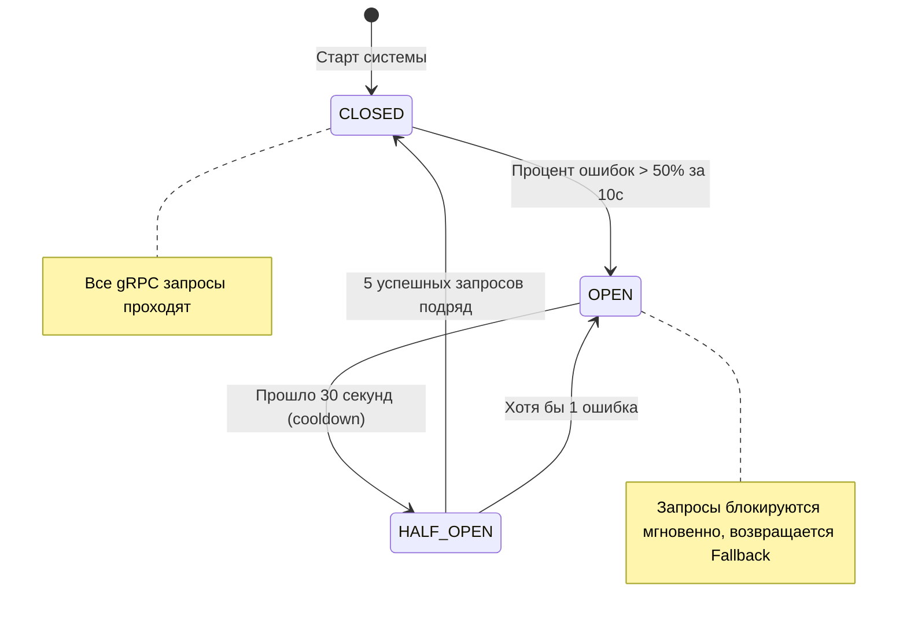
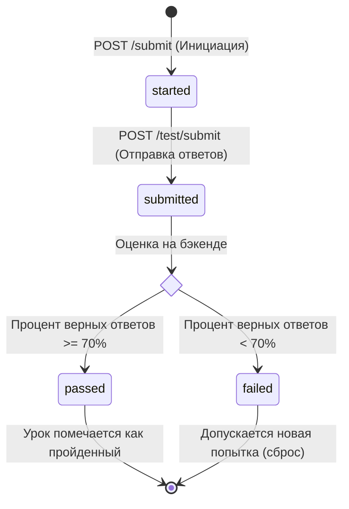
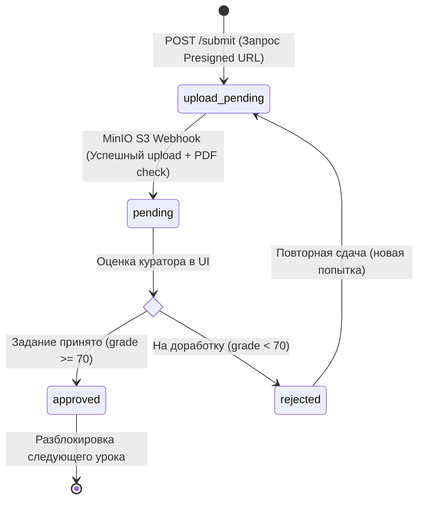

# Архитектурный дизайн-документ: MathalamaEdu

Этот документ описывает техническую архитектуру, модель данных и системные интеграции для **MathalamaEdu** — событийно-ориентированной системы управления обучением (LMS). 

---

## 1. Выбор технологического стека (Justification & Trade-offs)

### Backend: Go (Golang)
*   **Почему:** Go обеспечивает высокую производительность при минимальном потреблении ресурсов (памяти и CPU), что критично для облачных развертываний в ЕС. Строгая типизация облегчает рефакторинг, а встроенные средства конкурентности (goroutines, channels) идеально подходят для написания сетевых сервисов и воркеров.
*   **Альтернативы:** Node.js (TypeScript) — проще в старте, но потребляет больше памяти и проигрывает в производительности CPU-интенсивных задач. Python (FastAPI) — удобен для прототипирования, но медленнее и сложнее масштабируется при высокой нагрузке на воркеры.

### База данных: PostgreSQL + Redis
*   **PostgreSQL:** Выбран в качестве основного ACID-совместимого хранилища. Отлично поддерживает реляционные связи, транзакции и сложные выборки. Поддержка JSONB полезна для хранения метаданных уроков или настроек профиля.
*   **Redis:** Используется для быстрого хранения сессий пользователей, кэширования прогресса студентов (чтобы разгрузить PostgreSQL при частых запросах к дашборду) и ограничения частоты запросов (Rate Limiting).

### Брокер сообщений: NATS JetStream
*   **Почему:** NATS JetStream — это сверхбыстрая, легковесная и современная система обмена сообщениями, написанная на Go. Она поддерживает гарантии доставки (At-Least-Once), персистентность (JetStream) и встроенный Key-Value store. В отличие от RabbitMQ, NATS не требует установки Erlang, расходует в разы меньше оперативной памяти и легко развертывается.
*   **Сравнение с RabbitMQ:**
    | Критерий | NATS JetStream | RabbitMQ |
    | :--- | :--- | :--- |
    | **Потребление ресурсов** | Минимальное (~20-50MB RAM) | Высокое (~500MB+ RAM из-за Erlang VM) |
    | **Скорость (Througput)** | Экстремально высокая (миллионы msg/sec) | Высокая (десятки тысяч msg/sec) |
    | **Простота администрирования** | Очень простая (один бинарник, конфиг-файл) | Сложная (кластеризация, управление плагинами) |
    | **Интеграция с Go** | Нативная (клиенты от авторов NATS) | Через сторонние библиотеки (amqp091) |

### Объектное хранилище: MinIO
*   **Почему:** MinIO — это self-hosted S3-совместимое хранилище. Позволяет локально в Docker-окружении эмулировать работу с AWS S3 без затрат. В продакшене MinIO можно бесшовно заменить на AWS S3 или Scaleway Object Storage без изменения кода бэкенда (достаточно сменить URL и ключи доступа).

---

## 2. Микросервисная архитектура и декомпозиция (Microservices Architecture)

Для масштабируемости, изоляции сбоев и удобства разработки MathalamaEdu проектируется как **микросервисная система**. Каждый микросервис отвечает за свою изолированную бизнес-область, работает в отдельном Docker-контейнере и владеет собственной базой данных (паттерн **Database-per-Service**).

### 2.1. Схема взаимодействия микросервисов:

```mermaid
flowchart TD
    subgraph Клиенты
        A[Студент (Веб-клиент)]
        B[Куратор (Веб-клиент)]
        C[Куратор (Telegram)]
    end

    subgraph API Gateway
        GW[API Gateway / Nginx]
    end

    subgraph Микросервисы
        MS_Auth[1. Auth & User Service]
        MS_Content[2. Course & Content Service]
        MS_Progress[3. Progress & Submissions Service]
        MS_Telegram[4. Telegram Bot Service]
        MS_Notify[5. Notification Service]
    end

    subgraph Очередь событий
        Broker[(NATS JetStream)]
    end

    subgraph Хранилища данных
        DB_Auth[(DB: Auth & Users)]
        DB_Content[(DB: Courses & Lessons)]
        DB_Progress[(DB: Progress & Submissions)]
        S3[(MinIO Object Storage)]
    end

    %% Взаимодействие клиентов
    A -->|HTTP / REST| GW
    B -->|HTTP / REST| GW
    C <-->|Telegram Bot API| MS_Telegram

    GW -->|Маршрутизация| MS_Auth
    GW -->|Маршрутизация| MS_Content
    GW -->|Маршрутизация| MS_Progress

    %% Связи с БД
    MS_Auth --> DB_Auth
    MS_Content --> DB_Content
    MS_Progress --> DB_Progress
    MS_Progress --> S3

    %% gRPC (Синхронные связи)
    MS_Progress -->|gRPC: Проверить права куратора| MS_Auth
    MS_Progress -->|gRPC: Проверить структуру урока| MS_Content
    MS_Telegram -->|gRPC: Проверить авторизацию| MS_Auth

    %% События (Асинхронные связи)
    MS_Progress ==>|Publish: submission.created / lesson.unlocked| Broker
    MS_Auth ==>|Publish: user.gdpr_delete_requested| Broker
    Broker ==>|Subscribe| MS_Telegram
    Broker ==>|Subscribe| MS_Notify
    Broker ==>|Subscribe: Очистить ДЗ студента по GDPR| MS_Progress
    MS_Telegram ==>|Publish: submission.reviewed| Broker
    Broker ==>|Subscribe: Записать оценку в БД| MS_Progress
```

### 2.2. Описание микросервисов, фич и нагрузочных профилей:

1. **Auth & User Service (Сервис авторизации и пользователей):**
   * **Зона ответственности:** Регистрация, авторизация (JWT), управление ролями, привязка Telegram-аккаунтов кураторов, GDPR-запросы.
   * **База данных:** Таблица `users`.
   * **Нагрузочный профиль:** **CPU-Bound (Высокая нагрузка на процессор).** 
     * Хэширование паролей при авторизации и регистрации (используется ресурсоемкий алгоритм bcrypt или Argon2) требует высоких вычислительных мощностей CPU.
     * Криптографические операции по генерации JWT и SHA-256 хэшированию email по GDPR также загружают процессор.
   * **Бутылочные горлышки:** Медленная обработка хэшей паролей при пиковых нагрузках (например, в начале учебного дня, когда все студенты одновременно логинятся).
   * **Стратегия масштабирования:** Горизонтальное масштабирование без состояния (Stateless Horizontal Scaling) реплик сервиса. Для защиты от CPU-exhaustion вызовы хэширования ограничиваются лимитами контейнеров (cgroups). Сессии кэшируются в Redis для обхода повторных чтений из БД.

2. **Course & Content Service (Сервис учебного контента):**
   * **Зона ответственности:** Создание курсов, наполнение модулей, конструктор уроков (видео, теория, тесты), массовый импорт тестов из JSON с транзакционной валидацией.
   * **База данных:** Таблицы `courses`, `modules`, `lessons`, `test_questions`, `test_question_options`.
   * **Нагрузочный профиль:** **Read-Heavy / Low-Write (Низкая запись, очень высокое чтение).**
     * Контент создается администраторами редко, но читается тысячами студентов круглосуточно.
     * Запросы на получение структуры модулей и уроков составляют до 80% всего трафика.
   * **Бутылочные горлышки:** Задержка (Latency) при обращении к базе данных для сборки структуры больших курсов (много джоинов уроков и вопросов).
   * **Стратегия масштабирования:** Агрессивное кэширование в Redis (кэшируются готовые структуры курсов в формате JSON). При обновлении урока администратором кэш инвалидируется по событию. Это позволяет отдавать контент за <2мс прямо из памяти Redis без единого обращения к PostgreSQL.

3. **Progress & Submissions Service (Сервис успеваемости и ДЗ):**
   * **Зона ответственности:** Логирование прохождения уроков (`lesson_progress`), попытки тестов (`test_attempts`), загрузка PDF-конспектов в MinIO, управление статусами проверки (`submissions`, `reviews`), управление группами (`cohorts`).
   * **База данных:** Таблицы `cohorts`, `cohort_students`, `lesson_progress`, `submissions`, `reviews`, `test_attempts`, `student_test_answers`.
   * **Нагрузочный профиль:** **Write-Heavy / High-Transactional (Интенсивная запись, высокая транзакционность).**
     * Самый нагруженный сервис в системе. При каждом просмотре видео летит пинг прогресса, при каждом ответе на тест пишется попытка, при сдаче ДЗ загружается тяжелый PDF.
     * Высокая дисковая активность (Disk I/O) и частые записи в PostgreSQL.
   * **Бутылочные горлышки:** Блокировки строк в СУБД (Lock Contention) при массовой одновременной сдаче тестов группой студентов, задержки при загрузке файлов в MinIO S3 при слабом интернет-соединении.
   * **Стратегия масштабирования:** 
     * Использование пула соединений PostgreSQL (PgBouncer) для предотвращения исчерпания коннектов.
     * Разделение БД на Master (для записи субмитов и ответов) и Read-Replica (для отображения успеваемости кураторам).
     * Загрузка файлов в MinIO через Presigned URLs: студент запрашивает у API ссылку, а сам файл грузит напрямую в MinIO в обход микросервиса, разгружая сеть сервиса.

4. **Telegram Bot Service (Интеграционный микросервис):**
   * **Зона ответственности:** Прием вебхуков от Telegram, отправка карточек кураторам, обработка кликов inline-кнопок, сбор оценок и фидбека в режиме диалога.
   * **Хранилище:** Redis для отслеживания текущего состояния куратора (FSM). Собственной дисковой БД нет.
   * **Нагрузочный профиль:** **I/O-Bound / Network-Heavy (Сетевая нагрузка, ожидание внешних API).**
     * Практически всё время тратится на ожидание ответов от серверов Telegram Bot API (HTTP-запросы).
     * Нагрузка носит взрывной (Spiky) характер (когда кураторы массово проверяют работы в свободное время).
   * **Бутылочные горлышки:** Строгие лимиты Telegram Bot API на отправку сообщений (не более 30 сообщений в секунду на одного бота во избежание спам-блокировок).
   * **Стратегия масштабирования:** Полностью stateless-архитектура, масштабируется горизонтально. Очередь отправки сообщений буферизируется через NATS JetStream: если кураторам нужно отправить 500 уведомлений, NATS выдает их порциями, соблюдая лимиты Telegram Bot API, предотвращая падение по ошибке `429 Too Many Requests`.

5. **Notification Service (Сервис оповещений):**
   * **Зона ответственности:** Отправка email-уведомлений студентам и кураторам.
   * **Нагрузочный профиль:** **Low-Load / Network-Bound (Низкая нагрузка, высокие сетевые таймауты).**
     * Медленная отправка писем через внешние SMTP / SendGrid / Amazon SES.
   * **Бутылочные горлышки:** Сетевые задержки при соединении со сторонними почтовыми серверами.
   * **Стратегия масштабирования:** Работает строго в фоне как потребитель (Consumer) событий NATS. Внутри сервиса используется пул воркеров (Worker Pool в Go), позволяющий отправлять десятки писем параллельно в неблокирующем режиме. Даже если SMTP-сервер зависнет на 10 секунд, это никак не повлияет на работу веб-сайта или Telegram-бота.

### 2.3. Протоколы межсервисного взаимодействия:

* **gRPC (Синхронный):** Используется для мгновенных, критически важных чтений данных между сервисами (например, проверить, существует ли пользователь с такой ролью). Протокол обеспечивает бинарную сериализацию (Protocol Buffers) и мультиплексирование запросов по HTTP/2, что снижает сетевую задержку до <1-2мс.
* **NATS JetStream (Асинхронный / Event-Driven):** Используется для всех остальных процессов (уведомления, открытие уроков, лог аналитики, GDPR очистка). Если один из сервисов (например, Telegram Bot или БД) временно недоступен, сообщения будут надежно храниться в очередях JetStream на диске и обработаются сразу после восстановления работоспособности сервиса.

### 2.4. Паттерны отказоустойчивости: Circuit Breaker и грациозная деградация (Fallbacks)

Синхронное общение по gRPC между микросервисами несет риск **каскадных сбоев**: если один сервис (например, `Auth & User Service`) упадет или перегрузится, зависшие gRPC-запросы от `Progress Service` забьют все сетевые сокеты и обрушат всю систему.

Для предотвращения этого на gRPC-клиентах внедряется паттерн **Circuit Breaker** («Предохранитель»):



#### Логика работы предохранителя:
1.  **Состояние CLOSED (Закрыт):** Обычный режим работы. Все gRPC-запросы проходят успешно. Предохранитель считает процент ошибок в скользящем окне времени (например, за последние 10 секунд).
2.  **Состояние OPEN (Открыт):** Если более 50% gRPC-запросов завершились сетевой ошибкой или таймаутом, предохранитель «вышибает» (триггерится). Все новые запросы к упавшему сервису **блокируются мгновенно на клиенте (Fail-Fast)** в обход сети, не перегружая систему. Клиент сразу возвращает резервный ответ (**Fallback**).
3.  **Состояние HALF-OPEN (Полуоткрыт):** Через 30 секунд «сна» предохранитель пропускает небольшую тестовую порцию запросов (например, 5 штук). Если все они прошли успешно — сервис считается ожившим, и предохранитель возвращается в статус **CLOSED**. Если хотя бы один упал — он снова уходит в **OPEN**.

#### Резервный сценарий (Fallback) при падении `Auth Service`:
Если `Auth Service` временно лежит и Circuit Breaker открыт, при обращении к `Progress Service`:
*   *Обычный запрос:* Должен был отправить gRPC-запрос в `Auth Service` для верификации JWT.
*   *Резервный сценарий (Fallback):* `Progress Service` переключается на **локальную криптографическую проверку JWT-токена** с помощью общего секретного ключа (заданного в `.env` при старте). 
*   *Результат (Грациозная деградация):* Студент может беспрепятственно смотреть видео и читать теорию на открытых уроках (поскольку сессия проверяется локально), но операции записи (загрузка PDF конспекта) временно блокируются до восстановления связи. Пользователь видит мягкое предупреждение вместо «упавшего» сайта.

#### Репликация сессий кураторов в Redis для Telegram Bot:
Для устранения зависимости Telegram Bot Service от gRPC-запросов к Auth Service во время массовых вебхуков от Telegram:
*   При авторизации куратора `Auth Service` дублирует объект профиля в Redis с ключом `curator:session:{telegram_chat_id}` и временем жизни (TTL) 24 часа.
*   `Telegram Bot Service` при получении вебхуков мгновенно верифицирует статус куратора непосредственно по локальному Redis. Это полностью исключает gRPC-запросы в штатном режиме, устраняет задержки вебхуков и защищает систему от шторма повторных запросов со стороны серверов Telegram при отказе `Auth Service`.

---

## 3. Схема базы данных и DDL (PostgreSQL)

Для обеспечения строгой целостности и готовности к GDPR-анонимизации спроектирована следующая физическая схема данных.

```sql
-- Включение расширения для генерации UUIDv4
CREATE EXTENSION IF NOT EXISTS "uuid-ossp";

-- Таблица пользователей (поддержка анонимизации)
CREATE TABLE users (
    id UUID PRIMARY KEY DEFAULT uuid_generate_v4(),
    email VARCHAR(255) NOT NULL,
    email_hash VARCHAR(64) NOT NULL, -- SHA256(email + salt) для предотвращения дубликатов при анонимизации
    first_name VARCHAR(100) NOT NULL,
    last_name VARCHAR(100) NOT NULL,
    password_hash VARCHAR(255) NOT NULL,
    role VARCHAR(20) NOT NULL CHECK (role IN ('admin', 'curator', 'student')),
    status VARCHAR(20) NOT NULL DEFAULT 'active' CHECK (status IN ('active', 'deleted_scheduled', 'anonymized')),
    telegram_chat_id VARCHAR(50) UNIQUE, -- ID чата в Telegram для оповещений и управления (кураторы)
    created_at TIMESTAMP WITH TIME ZONE NOT NULL DEFAULT CURRENT_TIMESTAMP,
    updated_at TIMESTAMP WITH TIME ZONE NOT NULL DEFAULT CURRENT_TIMESTAMP,
    deleted_at TIMESTAMP WITH TIME ZONE -- Для Soft Delete
);

-- Индексы для быстрого поиска пользователей
CREATE UNIQUE INDEX idx_users_email_active ON users(email) WHERE deleted_at IS NULL AND status = 'active';
CREATE UNIQUE INDEX idx_users_email_hash ON users(email_hash) WHERE deleted_at IS NULL;

-- Таблица курсов
CREATE TABLE courses (
    id UUID PRIMARY KEY DEFAULT uuid_generate_v4(),
    title VARCHAR(255) NOT NULL,
    description TEXT,
    created_at TIMESTAMP WITH TIME ZONE NOT NULL DEFAULT CURRENT_TIMESTAMP,
    updated_at TIMESTAMP WITH TIME ZONE NOT NULL DEFAULT CURRENT_TIMESTAMP
);

-- Модули курса
CREATE TABLE modules (
    id UUID PRIMARY KEY DEFAULT uuid_generate_v4(),
    course_id UUID NOT NULL REFERENCES courses(id) ON DELETE CASCADE,
    title VARCHAR(255) NOT NULL,
    sort_order INT NOT NULL, -- Порядок отображения модуля в курсе
    created_at TIMESTAMP WITH TIME ZONE NOT NULL DEFAULT CURRENT_TIMESTAMP,
    CONSTRAINT uniq_course_module_order UNIQUE (course_id, sort_order)
);

-- Уроки внутри модулей (поддержка комбинированного контента: видео + тест + конспект)
CREATE TABLE lessons (
    id UUID PRIMARY KEY DEFAULT uuid_generate_v4(),
    module_id UUID NOT NULL REFERENCES modules(id) ON DELETE CASCADE,
    title VARCHAR(255) NOT NULL,
    video_url VARCHAR(512), -- Ссылка на видеолекцию в MinIO/S3 (может быть NULL, если видео нет)
    theory_content TEXT, -- Текстовый конспект лекции или теория (может быть NULL)
    has_test BOOLEAN NOT NULL DEFAULT FALSE, -- Флаг: содержит ли урок интерактивный тест
    has_assignment BOOLEAN NOT NULL DEFAULT FALSE, -- Флаг: требуется ли загрузка письменного конспекта (PDF)
    sort_order INT NOT NULL, -- Порядок урока внутри модуля
    absolute_order INT NOT NULL, -- Денормализованный абсолютный порядковый номер урока в курсе для быстрого Content Dripping
    next_lesson_id UUID REFERENCES lessons(id) ON DELETE SET NULL, -- Ссылка на следующий урок для O(1) переходов без тяжелых CTE
    created_at TIMESTAMP WITH TIME ZONE NOT NULL DEFAULT CURRENT_TIMESTAMP,
    CONSTRAINT uniq_module_lesson_order UNIQUE (module_id, sort_order)
);

-- Учебные группы (Потоки)
CREATE TABLE cohorts (
    id UUID PRIMARY KEY DEFAULT uuid_generate_v4(),
    course_id UUID NOT NULL REFERENCES courses(id) ON DELETE CASCADE,
    curator_id UUID REFERENCES users(id) ON DELETE SET NULL, -- Куратор, закрепленный за группой
    name VARCHAR(100) NOT NULL, -- Например, "Весна 2026"
    created_at TIMESTAMP WITH TIME ZONE NOT NULL DEFAULT CURRENT_TIMESTAMP
);

-- Таблица связи студентов и групп (N-to-N)
CREATE TABLE cohort_students (
    cohort_id UUID NOT NULL REFERENCES cohorts(id) ON DELETE CASCADE,
    student_id UUID NOT NULL REFERENCES users(id) ON DELETE CASCADE,
    joined_at TIMESTAMP WITH TIME ZONE NOT NULL DEFAULT CURRENT_TIMESTAMP,
    PRIMARY KEY (cohort_id, student_id)
);

-- Прогресс студента по урокам (Реализация Content Dripping)
CREATE TABLE lesson_progress (
    id UUID PRIMARY KEY DEFAULT uuid_generate_v4(),
    student_id UUID NOT NULL REFERENCES users(id) ON DELETE CASCADE,
    lesson_id UUID NOT NULL REFERENCES lessons(id) ON DELETE CASCADE,
    status VARCHAR(20) NOT NULL DEFAULT 'locked' CHECK (status IN ('locked', 'unlocked', 'completed')),
    unlocked_at TIMESTAMP WITH TIME ZONE,
    completed_at TIMESTAMP WITH TIME ZONE,
    CONSTRAINT uniq_student_lesson_progress UNIQUE (student_id, lesson_id)
);

-- Домашние задания (Субмиты) студентов
CREATE TABLE submissions (
    id UUID PRIMARY KEY DEFAULT uuid_generate_v4(),
    student_id UUID NOT NULL REFERENCES users(id) ON DELETE SET NULL, -- SET NULL важен для GDPR анонимизации
    lesson_id UUID NOT NULL REFERENCES lessons(id) ON DELETE CASCADE,
    cohort_id UUID NOT NULL REFERENCES cohorts(id) ON DELETE CASCADE,
    status VARCHAR(20) NOT NULL DEFAULT 'upload_pending' CHECK (status IN ('upload_pending', 'pending', 'approved', 'rejected')),
    file_url VARCHAR(512), -- Ссылка на архив/файл с решением в MinIO/S3
    student_notes TEXT, -- Комментарий студента
    created_at TIMESTAMP WITH TIME ZONE NOT NULL DEFAULT CURRENT_TIMESTAMP,
    updated_at TIMESTAMP WITH TIME ZONE NOT NULL DEFAULT CURRENT_TIMESTAMP
);

CREATE INDEX idx_submissions_cohort_status ON submissions(cohort_id, status);

-- Проверки кураторов (Отзывы и Оценки)
CREATE TABLE reviews (
    id UUID PRIMARY KEY DEFAULT uuid_generate_v4(),
    submission_id UUID NOT NULL REFERENCES submissions(id) ON DELETE CASCADE,
    curator_id UUID REFERENCES users(id) ON DELETE SET NULL,
    feedback TEXT NOT NULL, -- Развернутый текстовый фидбек куратора
    grade INT CHECK (grade >= 0 AND grade <= 100), -- Оценка от 0 до 100 (университетская шкала в процентах)
    created_at TIMESTAMP WITH TIME ZONE NOT NULL DEFAULT CURRENT_TIMESTAMP
);

-- Вопросы интерактивного теста (для уроков с content_type = 'test')
CREATE TABLE test_questions (
    id UUID PRIMARY KEY DEFAULT uuid_generate_v4(),
    lesson_id UUID NOT NULL REFERENCES lessons(id) ON DELETE CASCADE,
    question_text TEXT NOT NULL,
    question_type VARCHAR(20) NOT NULL CHECK (question_type IN ('single', 'multiple', 'text')), -- одиночный выбор, множественный, текстовый ответ
    sort_order INT NOT NULL,
    created_at TIMESTAMP WITH TIME ZONE NOT NULL DEFAULT CURRENT_TIMESTAMP,
    CONSTRAINT uniq_lesson_question_order UNIQUE (lesson_id, sort_order)
);

-- Варианты ответов на вопросы теста
CREATE TABLE test_question_options (
    id UUID PRIMARY KEY DEFAULT uuid_generate_v4(),
    question_id UUID NOT NULL REFERENCES test_questions(id) ON DELETE CASCADE,
    option_text TEXT NOT NULL,
    is_correct BOOLEAN NOT NULL DEFAULT FALSE,
    created_at TIMESTAMP WITH TIME ZONE NOT NULL DEFAULT CURRENT_TIMESTAMP
);

-- Попытки прохождения тестов студентами
CREATE TABLE test_attempts (
    id UUID PRIMARY KEY DEFAULT uuid_generate_v4(),
    student_id UUID NOT NULL REFERENCES users(id) ON DELETE CASCADE,
    lesson_id UUID NOT NULL REFERENCES lessons(id) ON DELETE CASCADE,
    score INT NOT NULL CHECK (score >= 0 AND score <= 100), -- процент правильных ответов
    passed BOOLEAN NOT NULL DEFAULT FALSE,
    created_at TIMESTAMP WITH TIME ZONE NOT NULL DEFAULT CURRENT_TIMESTAMP
);

-- Сохраненные ответы студентов (для аудита и проверки результатов)
CREATE TABLE student_test_answers (
    id UUID PRIMARY KEY DEFAULT uuid_generate_v4(),
    attempt_id UUID NOT NULL REFERENCES test_attempts(id) ON DELETE CASCADE,
    question_id UUID NOT NULL REFERENCES test_questions(id) ON DELETE CASCADE,
    selected_option_id UUID REFERENCES test_question_options(id) ON DELETE CASCADE,
    text_answer TEXT, -- для вопросов с типом 'text'
    is_correct BOOLEAN NOT NULL DEFAULT FALSE
);

-- Таблица Outbox событий для паттерна Transactional Outbox
CREATE TABLE outbox (
    id UUID PRIMARY KEY DEFAULT uuid_generate_v4(),
    event_type VARCHAR(255) NOT NULL,
    payload JSONB NOT NULL,
    correlation_id VARCHAR(255) NOT NULL,
    status VARCHAR(50) NOT NULL DEFAULT 'pending' CHECK (status IN ('pending', 'processed', 'failed')),
    retry_count INT NOT NULL DEFAULT 0,
    created_at TIMESTAMP WITH TIME ZONE NOT NULL DEFAULT CURRENT_TIMESTAMP,
    processed_at TIMESTAMP WITH TIME ZONE
);

-- Индекс для высокопроизводительного опроса демоном
CREATE INDEX idx_outbox_pending ON outbox(created_at) WHERE status = 'pending';

---

## 5. Паттерн надежности событий: Transactional Outbox (Решение проблемы Dual Write)

### 5.1. Архитектурная проблема: Dual Write
При прямой отправке событий в NATS JetStream в кодовой базе (например, при одобрении ДЗ):
1. Use Case коммитит транзакцию в PostgreSQL.
2. Use Case вызывает `nats.Publish("submission.approved", ...)`.

Если шаг 2 падает из-за сетевого сбоя или перезагрузки NATS, база данных сохраняет статус, но остальная система (открытие следующего урока воркером, отправка писем) никогда не узнает о событии.

### 5.2. Решение через Transactional Outbox
Любое событие сохраняется в служебную таблицу `outbox` в рамках **той же транзакции**, что и основные данные.

```go
// Пример транзакционной бизнес-логики в Use Case:
tx, err := r.db.BeginTx(ctx)
defer tx.Rollback()

// 1. Обновляем статус субмита
err = r.submissionRepo.UpdateStatus(tx, submissionID, "approved")

// 2. Вместо вызова NATS пишем событие в Outbox
err = r.outboxRepo.CreateEvent(tx, "submission.approved", payload, correlationID)

tx.Commit()
```

### 5.3. Компонент Outbox Publisher (Daemon)
В каждом сервисе запускается фоновый демон `OutboxPublisher`:
1. Делает опрос: `SELECT * FROM outbox WHERE status = 'pending' ORDER BY created_at ASC LIMIT 100 FOR UPDATE SKIP LOCKED`.
2. Публикует пачку событий в NATS JetStream.
3. При получении подтверждения доставки (ACK) от NATS **физически удаляет (`DELETE`)** успешно обработанные строки из таблицы `outbox` в рамках той же транзакции. Это предотвращает бесконтрольное раздувание таблицы (Index Bloat) и обеспечивает стабильную производительность sequential scan при аварийных сбоях.
4. Защита от дубликатов: так как NATS JetStream гарантирует доставку **At-Least-Once**, подписчики воркеров спроектированы как **идемпотентные** (используют `ON CONFLICT DO UPDATE` на уровне PostgreSQL), поэтому возможные сетевые дубликаты полностью безопасны.

---

## 6. Системные валидационные ограничения (API & DB Limits)

Для защиты ресурсов (память, пулы коннектов СУБД) на уровнях Delivery и СУБД жестко зафиксированы следующие лимиты:

1. **Импорт тестов из JSON:**
   * Максимум вопросов в одном импорт-файле/запросе: **100** (защищает от длинных блокировок таблиц).
   * Максимум вариантов ответов (`options`) на один вопрос: **8**.
2. **Сложность структуры курсов:**
   * Максимум модулей в рамках одного курса: **50**.
   * Максимум уроков в рамках одного модуля: **100**.
3. **Загрузка PDF-файлов (submissions):**
   * Максимальный размер файла: строго до **20 МБ**.
   * Ограничение спама: не более **3 активных субмитов** (`pending` или `rejected`) на один урок от одного студента.
4. **Ограничения длины полей (СУБД):**
   * Содержимое теории/текст вопросов: до **65 535 символов** (тип `TEXT`).
   * Заметки студента/отзыв куратора: до **5 000 символов** (тип `VARCHAR(5000)` в СУБД для надежного лимитирования на диске).

---

## 7. Идемпотентный распределенный кэш прогресса (Progress Write-Behind Cache Pattern)

### 7.1. Архитектурная проблема: Пиковые нагрузки (Write-Heavy) на Progress Service
При высокой активности студентов (например, во время трансляций или перед дедлайнами) тысячи одновременных запросов на фиксацию прогресса просмотра видео вызывают огромную нагрузку на диск (Disk I/O) и взаимные блокировки строк в PostgreSQL. Поскольку каждый просмотр видео требует обновления статуса прохождения урока, частая прямая запись в реляционную БД не масштабируется.

### 7.2. Решение: Асинхронное кэширование Write-Behind с Redis
Вместо мгновенного коммита в PostgreSQL, `Progress Service` использует быструю in-memory память Redis для накопления изменений и их последующего пакетного сброса.

#### 1. Схема записи (In-Memory HSET/SADD)
Когда от студента поступает запрос о просмотре видеолекции:
1. API-хендлер выполняет атомарный моментальный вызов `HSET progress:pending:{student_id} {lesson_id} "completed"` в Redis.
2. Идентификатор изменившегося студента добавляется в список измененных: `SADD progress:dirty_students {student_id}`.
3. API возвращает HTTP-ответ `200 OK` за **<1мс**. Доступа к PostgreSQL на этом шаге не происходит.

#### 2. Фоновый сброс (Batch Ingestion via CacheFlusher)
Специальный фоновый демон `CacheFlusher` работает по расписанию (каждые 10 секунд):
1. Извлекает пачку изменившихся студентов через `SPOP progress:dirty_students 100` (безопасное атомарное извлечение).
2. Для каждого извлеченного `student_id` считывает кэшированный прогресс через `HGETALL progress:pending:{student_id}`.
3. Формирует единый пакетный SQL Bulk Insert запрос для базы данных:
   ```sql
   INSERT INTO lesson_progress (student_id, lesson_id, status, completed_at)
   VALUES (?, ?, 'completed', NOW())
   ON CONFLICT (student_id, lesson_id) 
   DO UPDATE SET status = EXCLUDED.status, completed_at = EXCLUDED.completed_at;
   ```
4. После успешного Bulk UPSERT в PostgreSQL удаляет перенесенный кэш из Redis через `HDEL progress:pending:{student_id} {lesson_id}`.

### 7.3. Обеспечение консистентности: Гибридное чтение (Hybrid Read / Merge)
Для предотвращения рассинхронизации данных при обновлении личного кабинета (когда прогресс в Redis еще не сброшен на диск) чтение выполняется по гибридному сценарию:
1. Use Case запрашивает базовый прогресс студента из PostgreSQL (`SELECT`).
2. Запрашивает свежий, еще не сброшенный прогресс из Redis (`HGETALL progress:pending:{student_id}`).
3. Производит слияние (**Merge**): если в Redis статус урока новее (например, `completed` против `unlocked` в БД), то запись из Redis перезаписывает дисковое состояние перед отдачей ответа клиенту.

### 7.4. Безопасность и валидация загрузки ДЗ: MinIO S3 Webhook Verification
Для исключения битых ссылок (когда студент запросил Presigned URL, но не загрузил файл) и загрузки вредоносного ПО:
1. **Фаза инициации:** При запросе на загрузку бэкенд создает запись в таблице `submissions` со статусом `upload_pending` и генерирует Presigned URL для прямой загрузки в MinIO.
2. **Webhook уведомление:** В MinIO настраивается интеграция для отправки события `s3:ObjectCreated:Put` в NATS JetStream в топик `mathalama.s3.object.created` при успешном физическом завершении загрузки.
3. **Верификация воркером:** Специализированный воркер `S3VerificationWorker` слушает этот топик, считывает первые байты файла (Magic Bytes) непосредственно из хранилища для проверки реального MIME-типа (допускается только валидный PDF), проверяет лимит размера и переводит статус субмита в `pending` (ожидает проверки куратором).

### 7.5. Защита от Race Conditions: NATS JetStream Key-Based Routing (Partitioning)
При горизонтальном масштабировании воркеров в Queue Group нарушается последовательность обработки сообщений из-за сетевых задержек. Для гарантии порядка:
1. **Стрим с разнесением по ключу:** Тема стрима NATS JetStream настраивается с шаблоном `mathalama.events.submission.approved.*`.
2. **Публикация по Student ID:** События о ДЗ отправляются по адресу `mathalama.events.submission.approved.{student_id}`.
3. **Consumer Partitioning:** Потребители JetStream настраиваются на фильтрацию по суффиксам или через упорядоченные потребители (Ordered Consumers), гарантируя, что все события, относящиеся к одному конкретному студенту, обрабатываются строго последовательно и попадают на один инстанс воркера.

---

### 7.6. Конечные автоматы состояний (State Machines)

Для обеспечения надежного контроля за обучением и сдачей работ логика ключевых сущностей платформы жестко регламентируется с помощью конечных автоматов. Любое изменение состояния валидируется и влечет за собой генерацию доменных событий.

#### 1. Конечный автомат интерактивных тестов (`test_attempts`)

Интерактивные тесты проверяются автоматически на стороне бэкенда.



* **Состояния:**
  * `started`: Сессия тестирования начата, студент запрашивает вопросы. Время начала фиксируется в `started_at` для защиты от превышения лимита времени (таймаут теста — 60 минут).
  * `submitted`: Ответы отправлены бэкенду. Система блокирует повторную отправку ответов по этой попытке.
  * `passed`: Успешная сдача (оценка $\ge 70\%$). В бэкенде вычисляется балл, отправляется доменное событие `test.passed`. Студенту засчитывается прохождение компонента "тест".
  * `failed`: Тест провален (оценка $< 70\%$). Генерируется событие `test.failed`. Студент может инициировать новую попытку сдачи (создается новая запись в БД со статусом `started`).

* **Правила валидации переходов:**
  * Переход в `submitted` возможен только из состояния `started`.
  * Если разница во времени `NOW() - started_at` превышает 60 минут, попытка автоматически переводится в `failed` с оценкой `0%` (таймаут).
  * Попытка сдачи в состоянии `passed` или `failed` является окончательной и не подлежит редактированию.

---

#### 2. Конечный автомат домашних заданий (`homework_submissions`)

Домашние задания требуют загрузки файлов и ручной проверки куратором.



* **Состояния:**
  * `upload_pending`: Студент инициировал сдачу работы. Создана запись в БД, сгенерирован Presigned URL для загрузки. Физического файла в S3 еще нет. Задание не отображается в панели куратора.
  * `pending`: Файл успешно загружен в S3. MinIO отправил событие `ObjectCreated` в NATS, `S3VerificationWorker` подтвердил валидность PDF (Magic Bytes) и размер файла. Задание поступает в очередь на проверку куратору.
  * `approved`: Домашняя работа проверена и одобрена куратором (выставлена оценка $\ge 70\%$). Это состояние окончательное. Генерируется событие `submission.approved`, запускающее `Dripping Worker` для разблокировки следующего урока.
  * `rejected`: Работа отклонена куратором (выставлена оценка $< 70\%$ или написан отзыв с требованием доработки). Генерируется событие `submission.rejected`. Студент видит комментарий куратора в ЛК и может отправить работу заново (с переходом в новую итерацию `upload_pending`).

* **Правила валидации переходов:**
  * **Переход `upload_pending` $\rightarrow$ `pending`:** Выполняется только асинхронным воркером `S3VerificationWorker` после сверки размера файла ($\le 20$ МБ) и Magic Bytes (`%PDF`). Если файл не валиден, запись переводится в `rejected` с комментарием "Ошибка валидации файла".
  * **Лимит попыток (Spam Protection):** Студент не может иметь более **3 активных субмитов** в статусах (`upload_pending`, `pending` или `rejected`) по одному уроку одновременно. Если лимит превышен, API возвращает ошибку `LIMIT_EXCEEDED` и блокирует создание нового субмита.
  * **Переход `pending` $\rightarrow$ `approved`/`rejected`:** Возможен только по запросу от куратора, закрепленного за когортой данного студента (проверка прав выполняется через gRPC-запрос к `Auth Service`).
