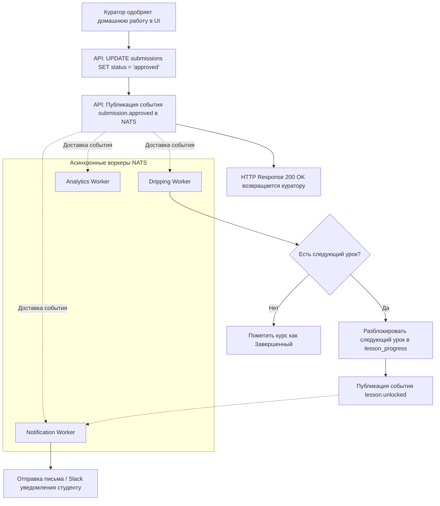

# Content Dripping Engine: Проектирование движка последовательного обучения

**Content Dripping (Капельная подача контента)** — это ключевая методология современного онлайн-обучения, которая защищает студента от когнитивной перегрузки, не позволяя «прокликать» весь курс за один день. Доступ к новым материалам открывается строго порциями и последовательно.

В **MathalamaEdu** движок спроектирован как асинхронный компонент, реагирующий на события прохождения курса.

---

## 1. Модели предоставления доступа

Мы закладываем три гибкие модели открытия уроков, настраиваемые администратором при создании когорты:

1.  **Линейная зависимость (ДЗ $\rightarrow$ Доступ):**
    *   Следующий урок открывается *только* после того, как куратор проверил и одобрил домашнюю работу по текущему уроку (`submission.approved`).
2.  **Временная шкала (Time-based):**
    *   Уроки открываются строго по календарю группы (например: *"Модуль 2 открывается для всех студентов потока «Весна 2026» 1 июня в 09:00 по Лондону"*).
3.  **Гибридная модель (Дедлайн + Одобрение):**
    *   Урок становится доступен в определенную дату, но только если у студента нет хвостов по домашним работам за предыдущие модули.

---

## 2. Архитектура асинхронного воркера (Dripping Worker)

Реализация линейной модели в рамках стандартного HTTP-запроса куратора перегружает API. Если во время сохранения оценки упадет почтовый сервис уведомлений, куратор получит ошибку HTTP 500, хотя оценка в БД уже записалась.

Поэтому процесс вынесен в асинхронный воркер NATS JetStream.



---

## 3. Алгоритм определения следующего урока в Go/SQL

Когда воркер обрабатывает событие `submission.approved`, ему необходимо вычислить `lesson_id` следующего по порядку урока.

### SQL-запрос для вычисления следующего урока:
Мы ищем урок, у которого порядок сортировки (`sort_order`) больше текущего внутри текущего модуля. Если такого урока нет, мы берем первый урок следующего модуля по порядку `sort_order`.

```sql
WITH current_lesson AS (
    SELECT module_id, sort_order 
    FROM lessons 
    WHERE id = :current_lesson_id
),
next_lesson_in_module AS (
    -- Пытаемся найти следующий урок в том же модуле
    SELECT l.id, l.module_id, 1 as priority
    FROM lessons l
    JOIN current_lesson cl ON l.module_id = cl.module_id
    WHERE l.sort_order > cl.sort_order
    ORDER BY l.sort_order ASC
    LIMIT 1
),
next_module AS (
    -- Если уроков в модуле не осталось, ищем первый урок следующего модуля
    SELECT l.id, l.module_id, 2 as priority
    FROM lessons l
    JOIN modules m ON l.module_id = m.id
    JOIN current_lesson cl ON m.course_id = (SELECT course_id FROM modules WHERE id = cl.module_id)
    WHERE m.sort_order > (SELECT sort_order FROM modules WHERE id = cl.module_id)
    ORDER BY m.sort_order ASC, l.sort_order ASC
    LIMIT 1
),
combined AS (
    SELECT * FROM next_lesson_in_module
    UNION ALL
    SELECT * FROM next_module
)
SELECT id FROM combined
ORDER BY priority ASC
LIMIT 1;
```

---

## 4. Защита отRace Conditions и гарантия Идемпотентности

При асинхронной обработке событий высока вероятность столкнуться с сетевыми дублями (когда NATS доставляет событие `submission.approved` дважды из-за сбоя сети перед отправкой подтверждения/ACK).

Если два воркера одновременно попытаются разблокировать один и тот же урок для студента, возникнет состояние гонки (Race Condition).

### Инженерные меры защиты:

1.  **Констрейнты на уровне БД (Database Level):**
    Уникальный индекс в PostgreSQL гарантирует, что для пары (Студент, Урок) может существовать только одна запись прогресса:
    ```sql
    CREATE UNIQUE INDEX uniq_student_lesson_progress ON lesson_progress(student_id, lesson_id);
    ```
2.  **Идемпотентный INSERT (UPSERT):**
    В коде воркера мы используем конструкцию `ON CONFLICT DO NOTHING`, благодаря чему повторные события не вызовут ошибок и не перезапишут дату первоначального открытия урока:
    ```sql
    INSERT INTO lesson_progress (student_id, lesson_id, status, unlocked_at)
    VALUES ($1, $2, 'unlocked', NOW())
    ON CONFLICT (student_id, lesson_id) 
    DO UPDATE SET 
        -- Обновляем статус только если урок был locked
        status = CASE 
            WHEN lesson_progress.status = 'locked' THEN 'unlocked' 
            ELSE lesson_progress.status 
        END,
        unlocked_at = CASE 
            WHEN lesson_progress.status = 'locked' THEN NOW() 
            ELSE lesson_progress.unlocked_at 
        END;
    ```
3.  **Логический версионинг (Optimistic Locking):**
    Для обновления статусов домашних заданий используется проверка предыдущего состояния:
    ```sql
    UPDATE submissions 
    SET status = 'approved', updated_at = NOW() 
    WHERE id = :submission_id AND status = 'pending';
    ```
    Если СУБД вернула `0` затронутых строк, значит статус задания уже был изменен (например, другим воркером или вручную), и воркер просто завершает работу без ошибки.

---

## 5. Преимущества архитектурного решения движка

Спроектированный таким образом движок последовательного доступа обеспечивает:
*   **Высокую производительность СУБД:** Сложные выборки следующего урока выполняются на стороне СУБД одним SQL-запросом с использованием CTE (Common Table Expressions) и приоритезации выборок, минимизируя сетевые задержки.
*   **Исключительную надежность в условиях конкурентных запросов:** Использование уникальных индексов на уровне СУБД в сочетании с UPSERT-логикой полностью нивелирует риски возникновения Race Conditions при дублировании сообщений.
*   **Масштабируемость процессов:** Асинхронный запуск разблокировки уроков снимает нагрузку с основного веб-сервера, гарантируя моментальный HTTP-ответ пользователю.

