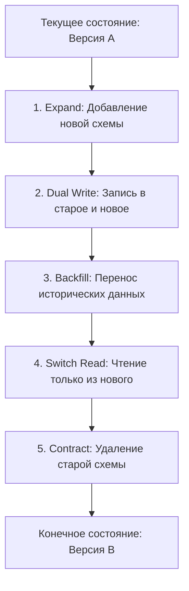

# Стратегия Zero-Downtime миграций СУБД (Database Schema Evolution)

В высоконагруженной распределенной архитектуре **MathalamaEdu** недопустима остановка системы (Downtime) для проведения технических работ на базах данных. Все изменения схемы PostgreSQL должны выполняться бесшовно, с поддержкой обратной совместимости, по методологии **Expand and Contract (Расширение и Сужение)**.

---

## 1. Концепция Expand and Contract

Паттерн разбивает одно потенциально разрушительное (Breaking Change) изменение базы данных на серию безопасных, обратно-совместимых шагов:



---

## 2. Практический кейс: Миграция `video_url` $\rightarrow$ `video_provider` + `video_id`

Рассмотрим детальный пятифазный пайплайн перехода от старого единого URL видеолекции к новой структуре внешних CDN-провайдеров без прерывания обслуживания пользователей.

### Фаза 1: Расширение схемы (Expand)
Мы создаем миграцию, которая добавляет новые столбцы и типы в БД, но **не удаляет** и **не изменяет** старое поле `video_url`. Столбцы создаются как `NULL` или имеют дефолтные значения для обратной совместимости с запущенным старым кодом.

#### SQL-миграция (`0002_add_video_provider.up.sql`):
```sql
-- 1. Создаем тип перечисления для видео-провайдеров
CREATE TYPE video_provider_type AS ENUM ('s3', 'youtube', 'kinoscope', 'vimeo', 'wistia', 'vk', 'rutube', 'boomstream');

-- 2. Добавляем колонки в lessons (как nullable)
ALTER TABLE lessons ADD COLUMN video_provider video_provider_type NOT NULL DEFAULT 's3';
ALTER TABLE lessons ADD COLUMN video_id VARCHAR(100);
```

#### SQL-откат (`0002_add_video_provider.down.sql`):
```sql
ALTER TABLE lessons DROP COLUMN IF EXISTS video_provider;
ALTER TABLE lessons DROP COLUMN IF EXISTS video_id;
DROP TYPE IF EXISTS video_provider_type;
```

---

### Фаза 2: Двойная запись (Dual Write)
Бэкенд-сервисы обновляются на новую версию кода, которая поддерживает двойную запись:
* **Чтение** по-прежнему происходит из старого поля `video_url` (если новые поля пусты).
* **Запись** (создание и редактирование уроков администратором) выполняется одновременно в три поля: `video_url`, `video_provider` и `video_id` (код бэкенда самостоятельно парсит провайдера из URL).

---

### Фаза 3: Перенос исторических данных (Backfill)
Поскольку миллионы старых записей содержат только `video_url`, запускается фоновый воркер (**Backfill Job**), который порциями (Batching) переносит исторические данные:

```go
package jobs

import (
	"context"
	"database/sql"
	"strings"
	"time"
)

// BackfillVideoFields парсит исторические video_url и заполняет video_provider / video_id
func BackfillVideoFields(ctx context.Context, db *sql.DB) error {
	limit := 100
	for {
		// Извлекаем порцию уроков, которые еще не обработаны
		rows, err := db.QueryContext(ctx, `
			SELECT id, video_url 
			FROM lessons 
			WHERE video_id IS NULL AND video_url IS NOT NULL 
			LIMIT $1`, limit)
		if err != nil {
			return err
		}

		var lessonsProcessed int
		for rows.Next() {
			var id, videoURL string
			if err := rows.Scan(&id, &videoURL); err != nil {
				rows.Close()
				return err
			}

			provider, videoID := parseVideoURL(videoURL)

			_, err = db.ExecContext(ctx, `
				UPDATE lessons 
				SET video_provider = $1, video_id = $2 
				WHERE id = $3`, provider, videoID, id)
			if err != nil {
				rows.Close()
				return err
			}
			lessonsProcessed++
		}
		rows.Close()

		// Если обработанных записей меньше лимита — все исторические данные перенесены
		if lessonsProcessed < limit {
			break
		}
		
		// Пауза между батчами для предотвращения локов БД и CPU-шторма
		time.Sleep(100 * time.Millisecond)
	}
	return nil
}

func parseVideoURL(url string) (string, string) {
	if strings.Contains(url, "youtube.com") {
		// Парсинг ID ютуб видео...
		return "youtube", "yt-id"
	}
	if strings.Contains(url, "kinoscope.io") {
		return "kinoscope", "kino-id"
	}
	return "s3", url // Фолбек на локальный S3
}
```

---

### Фаза 4: Переключение чтения (Switch Read)
Когда исторические данные полностью перенесены (проверить: `SELECT COUNT(*) FROM lessons WHERE video_id IS NULL AND video_url IS NOT NULL` равен 0), раскатывается новая версия кода бэкенда:
* **Чтение** переключается строго на новые поля `video_provider` и `video_id`.
* **Запись** полностью перестает использовать старое поле `video_url`.

---

### Фаза 5: Сужение схемы (Contract)
Когда старый код полностью выведен из эксплуатации и все инстансы бэкенда переключены на Фазу 4, мы безопасно удаляем старую схему:

#### SQL-миграция (`0003_drop_old_video_url.up.sql`):
```sql
ALTER TABLE lessons DROP COLUMN IF EXISTS video_url;
```

#### SQL-откат (`0003_drop_old_video_url.down.sql`):
```sql
ALTER TABLE lessons ADD COLUMN video_url VARCHAR(512);
```

---

## 3. Золотые правила Zero-Downtime миграций в MathalamaEdu

1. **Никаких дефолтных значений, требующих перезаписи таблицы (Table Rewrite):** 
   Применение `ALTER TABLE ... ADD COLUMN ... DEFAULT 'some_value'` на больших таблицах блокирует таблицу (`AccessExclusiveLock`) на время полной перезаписи диска. Для высоконагруженных таблиц колонку добавляют как `NULLABLE`, раскатывают код с логикой дефолта, а затем фоновым батчем заполняют данные.
2. **Индексы создаются неблокирующим образом:**
   В PostgreSQL создание индексов блокирует запись. Все новые индексы обязаны создаваться с флагом `CONCURRENTLY`:
   ```sql
   CREATE INDEX CONCURRENTLY idx_lessons_absolute_order ON lessons(absolute_order);
   ```
3. **Ограничение времени блокировки (Lock Timeout):**
   Любая DDL операция должна выполняться с жестким лимитом ожидания лока, чтобы не забить пул соединений при высокой конкуренции:
   ```sql
   SET statement_timeout = '5s';
   SET lock_timeout = '4s';
   ```
4. **Инструментарий миграций:**
   В качестве стандарта кодовой базы используется библиотека **`golang-migrate/migrate`** или инструмент **`goose`**, интегрированный в CI/CD пайплайн. Миграции накатываются автоматически при деплое Kubernetes-пода инициализации (`InitContainer`) перед запуском основных инстансов API.
