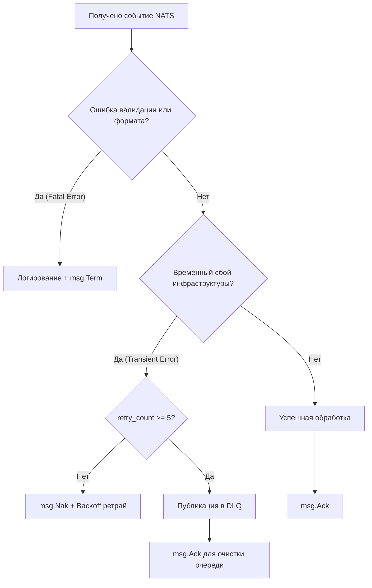

# Руководство по реализации Event-Driven архитектуры в Go на базе NATS JetStream

Событийно-ориентированная архитектура (Event-Driven) требует надежной основы для обмена сообщениями, обработки ошибок, повторных попыток и отслеживания сквозного пути запроса (Distributed Tracing).

В этом руководстве описывается, как спроектировать и написать надежный событийный слой для **MathalamaEdu** на языке **Go (Golang)** с использованием **NATS JetStream**.

---

## 1. Концепция обертки событий (Event Envelope)

Все события в системе должны иметь единую стандартизированную структуру (конверт). Это позволяет воркерам логировать сквозной путь событий, фильтровать сообщения и обеспечивать безопасность.

### Структура Event Envelope (JSON):
```json
{
  "event_id": "a90dfc11-9e28-4ad0-b883-7c30932bb82a",
  "event_type": "submission.approved",
  "timestamp": "2026-05-22T21:58:00Z",
  "actor_id": "curator_uuid",
  "correlation_id": "trace-uuid-12345",
  "payload": {
    "submission_id": "submission_uuid",
    "student_id": "student_uuid",
    "cohort_id": "cohort_uuid",
    "lesson_id": "lesson_uuid"
  }
}
```

*   **`correlation_id` (Идентификатор корреляции):** Создается в HTTP-запросе и прокидывается через все очереди в воркеры. Позволяет в логах (через Kibana или Grafana Loki) увидеть всю цепочку действий: от клика куратора до отправки письма и открытия уроков.

---

## 2. Инициализация NATS JetStream в Go

Для работы с JetStream в Go используется официальная библиотека `github.com/nats-io/nats.go`. Мы реализуем автоматическое создание стримов (Streams) при запуске приложения, чтобы инфраструктура настраивалась сама.

### Шаблон инициализации (internal/platform/nats/nats.go):
```go
package nats

import (
	"context"
	"time"

	"github.com/nats-io/nats.go"
	"github.com/rs/zerolog/log"
)

type JetStreamBroker struct {
	nc *nats.Conn
	js nats.JetStreamContext
}

func NewJetStreamBroker(url string) (*JetStreamBroker, error) {
	// Подключение с автоматическим переподключением
	nc, err := nats.Connect(url,
		nats.MaxReconnects(-1),
		nats.ReconnectWait(2*time.Second),
		nats.DisconnectErrHandler(func(c *nats.Conn, err error) {
			log.Warn().Err(err).Msg("NATS disconnected! Attempting to reconnect...")
		}),
		nats.ReconnectHandler(func(c *nats.Conn) {
			log.Info().Msg("NATS reconnected successfully.")
		}),
	)
	if err != nil {
		return nil, err
	}

	js, err := nc.JetStream()
	if err != nil {
		nc.Close()
		return nil, err
	}

	broker := &JetStreamBroker{nc: nc, js: js}
	
	// Авто-инициализация стрима для Mathalama
	if err := broker.setupStreams(); err != nil {
		nc.Close()
		return nil, err
	}

	return broker, nil
}

func (b *JetStreamBroker) setupStreams() error {
	// Настройка стрима "mathalama" для обработки событий обучения
	streamConfig := &nats.StreamConfig{
		Name:      "MATHALAMA",
		Subjects:  []string{"mathalama.events.>"},
		Retention: nats.LimitsPolicy, // Удалять сообщения при превышении лимитов
		MaxAge:    72 * time.Hour,     // Хранить сообщения не более 3 дней
		Storage:   nats.FileStorage,   // Сохранять сообщения на диск
	}

	_, err := b.js.AddStream(streamConfig)
	if err != nil && err != nats.ErrStreamNameAlreadyInUse {
		return err
	}

	log.Info().Msg("NATS JetStream initialized successfully. Stream [MATHALAMA] is ready.")
	return nil
}

func (b *JetStreamBroker) Close() {
	b.nc.Close()
}
```

---

## 3. Шаблон Публикации (Publisher Pattern)

Издатель формирует конверт события и публикует его в топик с префиксом `mathalama.events.`.

```go
package nats

import (
	"context"
	"encoding/json"
	"time"

	"github.com/google/uuid"
	"github.com/nats-io/nats.go"
)

type EventEnvelope struct {
	EventID       string          `json:"event_id"`
	EventType     string          `json:"event_type"`
	Timestamp     time.Time       `json:"timestamp"`
	ActorID       string          `json:"actor_id"`
	CorrelationID string          `json:"correlation_id"`
	Payload       json.RawMessage `json:"payload"`
}

func (b *JetStreamBroker) Publish(ctx context.Context, subject string, eventType string, actorID string, correlationID string, payload interface{}) error {
	rawPayload, err := json.Marshal(payload)
	if err != nil {
		return err
	}

	envelope := EventEnvelope{
		EventID:       uuid.New().String(),
		EventType:     eventType,
		Timestamp:     time.Now().UTC(),
		ActorID:       actorID,
		CorrelationID: correlationID,
		Payload:       rawPayload,
	}

	envelopeBytes, err := json.Marshal(envelope)
	if err != nil {
		return err
	}

	// Публикация события с подтверждением доставки (JetStream Publish)
	_, err = b.js.Publish(subject, envelopeBytes, nats.Context(ctx))
	return err
}
```

---

## 4. Шаблон Подписчика и Воркеров (Idempotent Consumer & Queue Group)

Чтобы масштабировать обработку событий и гарантировать, что сообщение обрабатывается только одним инстансом воркера, мы используем **Queue Groups (Группы очередей)**.

```go
package workers

import (
	"context"
	"encoding/json"
	"time"

	"github.com/nats-io/nats.go"
	"github.com/rs/zerolog/log"
)

type SubmissionApprovedPayload struct {
	SubmissionID string `json:"submission_id"`
	StudentID    string `json:"student_id"`
	CohortID     string `json:"cohort_id"`
	LessonID     string `json:"lesson_id"`
}

type DrippingWorker struct {
	js nats.JetStreamContext
	// Тут инжектируются репозитории (usecase) бэкенда
}

func (w *DrippingWorker) Start(ctx context.Context) error {
	// Подписка с использованием группы балансировки (Queue Group).
	// ВНИМАНИЕ: Стандартные Queue Groups в NATS JetStream распределяют сообщения round-robin.
	// Они НЕ гарантируют, что события по одному конкретному student_id (маска *) будут попадать
	// на один и тот же инстанс воркера. Разные события одного студента могут обрабатываться параллельно
	// на разных воркерах, создавая угрозу состояния гонки (Race Condition).
	//
	// МЕТОДЫ РЕШЕНИЯ RACE CONDITIONS В ВОРКЕРАХ:
	// 1. Оптимистичная блокировка (OCC): Контроль версий строк в PostgreSQL (столбец version).
	// 2. Распределенная блокировка: Использование Redis (SET key value NX PX) по student_id на время обработки.
	// 3. Subject-Based Partitioning: Издатель хэширует student_id в N партиций и публикует в темы
	//    типа "approved.part-1", "approved.part-2", а каждый воркер слушает строго свою партицию.
	sub, err := w.js.QueueSubscribe(
		"mathalama.events.submission.approved.*", // Топик с маской * (student_id)
		"dripping-worker-group",                  // Имя группы балансировки
		func(msg *nats.Msg) {
			w.handleEvent(msg)
		},
		nats.ManualAck(),             // Ручное подтверждение обработки (защита от падений)
		nats.AckWait(30*time.Second), // Таймаут на обработку
	)
	if err != nil {
		return err
	}

	// Ожидаем отмены контекста для Graceful Shutdown
	<-ctx.Done()
	log.Info().Msg("DrippingWorker is shutting down...")
	return sub.Unsubscribe()
}

func (w *DrippingWorker) handleEvent(msg *nats.Msg) {
	var envelope struct {
		CorrelationID string          `json:"correlation_id"`
		Payload       json.RawMessage `json:"payload"`
	}

	if err := json.Unmarshal(msg.Data, &envelope); err != nil {
		log.Error().Err(err).Msg("Failed to unmarshal event envelope")
		msg.Nak() // Сообщаем NATS, что обработка не удалась (событие вернется в очередь)
		return
	}

	// Настройка контекста логгера для трассировки
	logger := log.With().Str("correlation_id", envelope.CorrelationID).Logger()

	var payload SubmissionApprovedPayload
	if err := json.Unmarshal(envelope.Payload, &payload); err != nil {
		logger.Error().Err(err).Msg("Failed to unmarshal event payload")
		msg.Term() // Терминируем сообщение (битый JSON не нужно пытаться обработать снова)
		return
	}

	logger.Info().Str("submission_id", payload.SubmissionID).Msg("Processing submission approval...")

	// --- ВЫЗОВ БИЗНЕС-ЛОГИКИ ---
	// err := w.drippingUsecase.UnlockNextLesson(context.Background(), payload.StudentID, payload.LessonID)
	// ---------------------------

	// Подтверждаем успешную обработку
	if err := msg.Ack(); err != nil {
		logger.Error().Err(err).Msg("Failed to ACK message to NATS")
	} else {
		logger.Info().Msg("Event processed and ACKed successfully.")
	}
}
```

---

## 5. Защита от сбоев (Failure Recovery)

1.  **Manual ACK (Ручное подтверждение):** Воркер посылает `msg.Ack()` только после того, как транзакция в PostgreSQL успешно завершена. Если воркер крашнется в процессе обработки, NATS JetStream перенаправит сообщение другому воркеру по истечении `AckWait`.
2.  **Nak (Negative Acknowledgment):** Если произошел временный сбой (например, просела сеть до PostgreSQL), воркер вызывает `msg.Nak()`. Сообщение сразу же возвращается в очередь и пробуется снова.
3.  **Term (Termination):** Если обнаружена критическая логическая ошибка (битый формат JSON, несуществующий ID курса), воркер вызывает `msg.Term()`. Это удаляет сообщение из очереди окончательно, предотвращая бесконечные циклы обработки (poison pill).

---

## 6. Преимущества событийно-ориентированного подхода в реализации

*   **Надежность и устойчивость к сбоям (Resilience):** Использование ручного подтверждения (Manual Ack) полностью исключает потерю сообщений при временных падениях или перезагрузках инстансов микросервисов.
*   **Сквозная трассируемость (Traceability):** Поле `correlation_id` связывает асинхронную цепочку логов по всей системе, позволяя мгновенно отлаживать распределенные процессы.
*   **Изоляция ошибок и защита очереди:** Разделение обработки на повторные вызовы (`msg.Nak()`) и полную терминацию невалидных данных (`msg.Term()`) гарантирует защиту от забивания очередей невалидными задачами ("poison pills").

---

## 7. Каталог событий шины данных (NATS JetStream Schema)

Каждое доменное событие инкапсулируется в стандартный конверт `EventEnvelope` и содержит строго определенный формат полезной нагрузки (`payload`). Ниже приведена полная спецификация схем для ключевых событий платформы.

### 7.1. Событие: `user.gdpr_delete_requested`
Публикуется сервисом `Auth Service` при запросе пользователя на деактивацию и удаление аккаунта в соответствии с GDPR.
* **Тема (Subject):** `mathalama.events.user.gdpr_delete_requested`
* **Схема полезной нагрузки (`payload`):**
```json
{
  "user_id": "usr_902f1a30-cf8d-4ad1-a51b-02b489d2d480",
  "email_hash": "e3b0c44298fc1c149afbf4c8996fb92427ae41e4649b934ca495991b7852b855",
  "scheduled_deletion_at": "2026-06-05T21:58:00Z"
}
```

### 7.2. Событие: `submission.created`
Публикуется `Student API` при отправке студентом метаданных домашней работы. Сигнализирует о переходе в статус `upload_pending` и ожидании физического файла в S3.
* **Тема (Subject):** `mathalama.events.submission.created`
* **Схема полезной нагрузки (`payload`):**
```json
{
  "submission_id": "sub_777d1a10-fa98-4ad0-b883-7c30932bb82a",
  "student_id": "std_184920ab-2e38-410a-ba02-4c91a329d001",
  "lesson_id": "les_001b9201-9e28-4ad0-b883-7c30932bb82a",
  "file_path": "student-submissions/2026/05/sub-777.pdf"
}
```

### 7.3. Событие: `s3.object.created`
Генерируется непосредственно хранилищем MinIO S3 при успешном завершении физической загрузки файла студентом.
* **Тема (Subject):** `mathalama.s3.object.created`
* **Схема полезной нагрузки (`payload`):**
```json
{
  "event_version": "2.0",
  "event_source": "minio:s3",
  "aws_region": "us-east-1",
  "bucket_name": "student-submissions",
  "object_key": "2026/05/sub-777.pdf",
  "size_bytes": 1048576,
  "content_type": "application/pdf"
}
```

### 7.4. Событие: `submission.approved`
Публикуется куратором при успешном одобрении домашнего задания. Запускает автоматическую цепочку открытия уроков (Content Dripping).
* **Тема (Subject):** `mathalama.events.submission.approved.{student_id}`
* **Схема полезной нагрузки (`payload`):**
```json
{
  "submission_id": "sub_777d1a10-fa98-4ad0-b883-7c30932bb82a",
  "student_id": "std_184920ab-2e38-410a-ba02-4c91a329d001",
  "lesson_id": "les_001b9201-9e28-4ad0-b883-7c30932bb82a",
  "grade": 95,
  "reviewer_id": "cur_849201fa-9e28-4ad0-b883-7c30932bb82a"
}
```

### 7.5. Событие: `submission.rejected`
Публикуется куратором при отклонении работы и возврате на доработку.
* **Тема (Subject):** `mathalama.events.submission.rejected.{student_id}`
* **Схема полезной нагрузки (`payload`):**
```json
{
  "submission_id": "sub_777d1a10-fa98-4ad0-b883-7c30932bb82a",
  "student_id": "std_184920ab-2e38-410a-ba02-4c91a329d001",
  "lesson_id": "les_001b9201-9e28-4ad0-b883-7c30932bb82a",
  "feedback": "Необходимо подробнее расписать решение второго уравнения.",
  "reviewer_id": "cur_849201fa-9e28-4ad0-b883-7c30932bb82a"
}
```

### 7.6. Событие: `lesson.unlocked`
Генерируется `Dripping Worker` после разблокировки урока в БД. Запускает отправку пуш-уведомлений и писем студенту.
* **Тема (Subject):** `mathalama.events.lesson.unlocked`
* **Схема полезной нагрузки (`payload`):**
```json
{
  "student_id": "std_184920ab-2e38-410a-ba02-4c91a329d001",
  "lesson_id": "les_002b9202-9e28-4ad0-b883-7c30932bb82a",
  "unlocked_at": "2026-05-23T02:45:00Z"
}
```

---

## 8. Управление ошибками воркеров: Стратегия Backoff и DLQ

Для предотвращения зависания очередей и исключения потери событий в распределенной сети в MathalamaEdu внедрена строгая стратегия разделения ошибок и изоляции сбоев.



### 8.1. Классификация ошибок

Воркеры обязаны жестко разделять все возникающие ошибки на две группы:

1. **Временные ошибки (Transient Errors):**
   * Временное пропадание сети до базы данных PostgreSQL.
   * Исчерпание пула соединений (Connection Timeout).
   * Сетевой таймаут при чтении файла из MinIO S3.
   * *Реакция воркера:* Логирование предупреждения, вызов **`msg.Nak()`**. Событие возвращается в NATS для повторной обработки.

2. **Неисправимые / Фатальные ошибки (Fatal Errors):**
   * Ошибки парсинга JSON (битый конверт события).
   * Невалидные идентификаторы сущностей, нарушающие целостность данных СУБД (например, студент не существует).
   * Несовпадение Magic Bytes (загружен ZIP вместо PDF) при проверке файлов в S3.
   * *Реакция воркера:* Логирование критической ошибки с фиксацией `correlation_id` для ручного разбора, вызов **`msg.Term()`** (событие немедленно удаляется из очереди и не забивает поток).

### 8.2. Стратегия повторов (Exponential Backoff)

Для защиты PostgreSQL и NATS от перегрузки при массовых повторах (эффект "шторма запросов" / Retry Storm) NATS JetStream настраивается на экспоненциальную задержку доставки повторных сообщений:
* **Интервалы повторов:** $2^n \times 1$ секунда (где $n$ — номер попытки).
* Попытка 1: через 2 секунды.
* Попытка 2: через 4 секунды.
* Попытка 3: через 8 секунд.
* Попытка 4: через 16 секунд.
* Попытка 5: через 32 секунды.

Параметр задается на уровне потребителя JetStream (`BackOff` массив в настройках consumer).

### 8.3. Dead Letter Queue (DLQ / Очередь брака)

Если событие не удалось обработать после **5 последовательных попыток** (параметр `MaxDeliver = 5` в настройках NATS JetStream Consumer), воркер осуществляет изоляцию сбоя:

1. Считывает метаданные сообщения NATS для проверки числа доставок.
2. Публикует исходное событие со всей метаинформацией и `correlation_id` в специальный топик брака: `mathalama.dlq.<original_subject>`.
3. Сохраняет в заголовках сообщения DLQ причину сбоя (Error Message) и стек вызовов.
4. Вызывает **`msg.Ack()`** для успешного закрытия оригинальной транзакции NATS, чтобы сообщение удалилось из основной очереди.
5. Инженеры SRE настраивают мониторинг (Prometheus Alerts) на непустые очереди DLQ для немедленного реагирования и ручного исправления данных.


