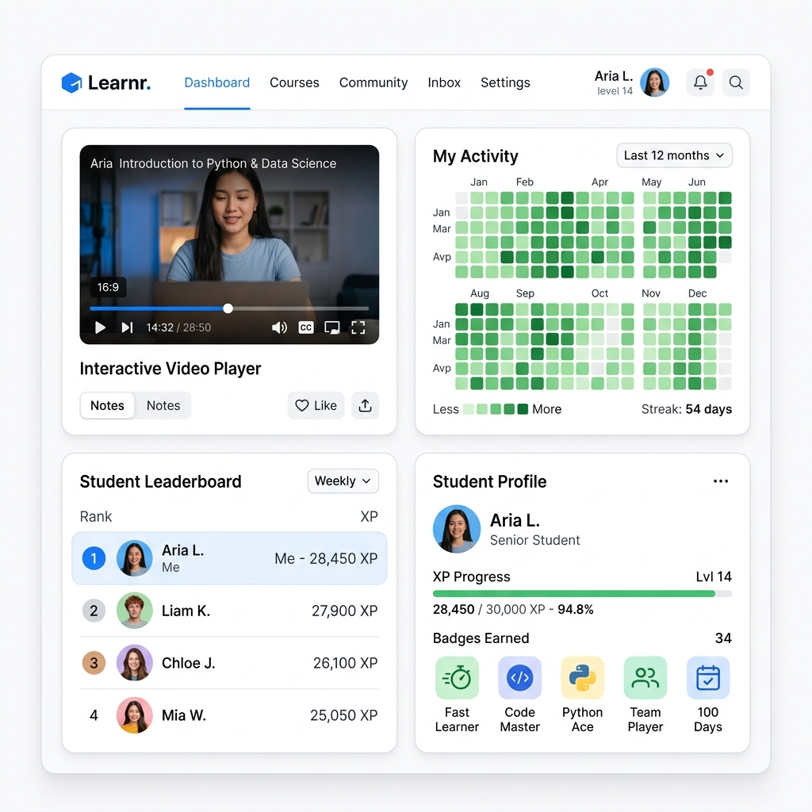

# Архитектура Фронтенда и Bento UI Дизайн-Система (Frontend & UI/UX Specification)

Интерфейс пользователя **MathalamaEdu** спроектирован по принципу модульной Bento-сетки с упором на премиальный светлый минимализм: идеально чистый белый фон, скругленные панели, тонкие изящные разделители и мягкие объемные тени. Этот дизайн-код обеспечивает максимальную концентрацию студента на обучении, полностью устраняя визуальный шум.

---

## 1. Технологический Стек Фронтенда (Client Architecture)

Архитектура клиентского приложения базируется на современных стандартах веб-инженерии для достижения субсекундного времени загрузки страниц (LCP < 1.2s):

*   **Фреймворк:** **Next.js (App Router)**.
    *   **React Server Components (RSC):** Все статичные элементы лекций, структура курсов и текстовые описания рендерятся на стороне сервера, минимизируя размер JS-бандла, загружаемого клиентом.
    *   **Client Components:** Используются точечно для интерактивных элементов: видеоплеера, графиков успеваемости, тестов и календаря активности.
*   **Управление Состоянием:**
    *   **Zustand:** Легковесный менеджер глобального состояния на клиенте. Используется для хранения сессии авторизации пользователя (`AuthStore`) и управления очередью всплывающих push-уведомлений.
    *   **TanStack Query (React Query):** Управление кэшем серверного состояния. Отвечает за реактивную подгрузку прогресса, автоматический фоновый рефетч лидербордов при смене табов и инвалидацию кэша при отправке выполненных заданий.

---

## 2. Bento UI Дизайн-Система и Визуальные Константы

Визуальный стиль интерфейса строится на концепции независимых Bento-карточек с мягким размытием теней. Любые упоминания сторонних ОС или брендов полностью исключены в пользу оригинального минималистичного дизайн-кода.

### 2.1. Цветовая палитра
*   `Background (Фон страницы):` Идеальный белый `#ffffff` или ультра-светлый серый фоновый оттенок `#f8f9fa` для контрастности карточек.
*   `Card Background (Фон карточек):` Белоснежный `#ffffff`.
*   `Border (Границы карточек):` Тонкие разделители цвета Zinc-100 `#e4e4e7` или Zinc-200 `#d4d4d8`.
*   `Accent Primary (Бренд-акцент):` Глубокий индиго-синий `#2563eb` (Blue-600).
*   `Accent Success (Прогресс и Активность):` Сочный изумрудно-зеленый `#10b981` (Emerald-500) для заполнения календаря активности и шкал успеваемости.

### 2.2. Константы разметки карточек (CSS Styles)
Каждая Bento-карточка дашборда обязана строго следовать следующим CSS-параметрам:
```css
.bento-card {
    background-color: #ffffff;
    border: 1px solid #e4e4e7; /* Тонкая изящная рамка */
    border-radius: 24px;       /* Увеличенное скругление углов */
    padding: 24px;             /* Просторные внутренние отступы */
    
    /* Мягкая, размытая тень для создания ощущения парения над фоном */
    box-shadow: 0 10px 40px -10px rgba(0, 0, 0, 0.04),
                0 1px 3px 0 rgba(0, 0, 0, 0.01);
    
    transition: transform 0.2s ease, box-shadow 0.2s ease;
}

.bento-card:hover {
    transform: translateY(-2px); /* Микро-анимация при наведении */
    box-shadow: 0 20px 40px -12px rgba(0, 0, 0, 0.06);
}
```

---

## 3. Схема Bento-Сетки Личного Кабинета Студента

Кабинет студента организован в виде адаптивной CSS Grid сетки из четырех ключевых функциональных блоков.

```mermaid
grid
    layout
        [Интерактивный Видеоплеер] [Календарь Активности (Heatmap)]
        [Лидерборд Студентов]      [Профиль, XP и Ачивки]
```

### Реализация сетки на TailwindCSS:
```html
<div class="grid grid-cols-1 lg:grid-cols-2 gap-6 p-8 bg-[#ffffff] min-h-screen">
  <!-- Блок 1: Интерактивный плеер -->
  <div class="lg:col-span-1 bg-white border border-zinc-200 rounded-3xl p-6 shadow-sm">
    <!-- Плеер -->
  </div>

  <!-- Блок 2: Календарь активности (GitHub-style Heatmap) -->
  <div class="lg:col-span-1 bg-white border border-zinc-200 rounded-3xl p-6 shadow-sm">
    <!-- Сетка дней -->
  </div>

  <!-- Блок 3: Лидерборд -->
  <div class="lg:col-span-1 bg-white border border-zinc-200 rounded-3xl p-6 shadow-sm">
    <!-- Рейтинг -->
  </div>

  <!-- Блок 4: Профиль и XP -->
  <div class="lg:col-span-1 bg-white border border-zinc-200 rounded-3xl p-6 shadow-sm">
    <!-- Ачивки и уровень -->
  </div>
</div>
```

---

## 4. Визуальный Макет Интерфейса (Mockup)

Ниже представлен премиальный визуальный дизайн-макет личного кабинета студента MathalamaEdu, сгенерированный в соответствии с описанными спецификациями светлой Bento-архитектуры:



---

## 5. Интерактивные Компоненты Фронтенда (Код)

### 5.1. Рендеринг Календаря Активности (GitHub-style Heatmap в React)
Компонент считывает годовой хэш активности из Redis (полученный по REST API `/api/v1/student/activity/heatmap`) и строит интерактивную SVG-карту:

```tsx
import React from 'react';

interface ActivityDay {
  date: string;          // YYYY-MM-DD
  activity_count: number; // Счет действий
  xp_earned: number;      // Очки опыта
}

interface HeatmapProps {
  days: ActivityDay[];
}

export const ActivityHeatmap: React.FC<HeatmapProps> = ({ days }) => {
  // Функция определения насыщенности зеленого цвета на основе активности
  const getColorClass = (count: number) => {
    if (count === 0) return 'fill-zinc-100'; // Серый цвет (нет активности)
    if (count <= 2) return 'fill-emerald-100'; // Светло-зеленый
    if (count <= 5) return 'fill-emerald-300'; // Зеленый средний
    return 'fill-emerald-500'; // Глубокий изумрудный
  };

  return (
    <div class="flex flex-col space-y-4">
      <div class="flex justify-between items-center">
        <h3 class="text-lg font-bold text-zinc-900">Моя активность</h3>
        <span class="text-sm text-zinc-500">За последние 12 месяцев</span>
      </div>
      
      {/* Сетка дней (упрощенный SVG-рендер сетки коммитов) */}
      <svg width="100%" height="110" viewBox="0 0 720 110" class="overflow-visible">
        <g transform="translate(0, 20)">
          {days.map((day, index) => {
            const week = Math.floor(index / 7);
            const dayOfWeek = index % 7;
            const x = week * 14;
            const y = dayOfWeek * 14;
            
            return (
              <rect
                key={day.date}
                x={x}
                y={y}
                width="10"
                height="10"
                rx="2"
                className={`transition-all duration-150 cursor-pointer hover:stroke-zinc-400 ${getColorClass(day.activity_count)}`}
              >
                <title>{`${day.date}: ${day.activity_count} действий, +${day.xp_earned} XP`}</title>
              </rect>
            );
          })}
        </g>
      </svg>
      
      <div class="flex items-center justify-between text-xs text-zinc-400">
        <div class="flex space-x-1 items-center">
          <span>Меньше</span>
          <div class="w-2.5 h-2.5 bg-zinc-100 rounded-sm"></div>
          <div class="w-2.5 h-2.5 bg-emerald-100 rounded-sm"></div>
          <div class="w-2.5 h-2.5 bg-emerald-300 rounded-sm"></div>
          <div class="w-2.5 h-2.5 bg-emerald-500 rounded-sm"></div>
          <span>Больше</span>
        </div>
        <span class="font-medium text-emerald-600">Серия: 54 дня подряд</span>
      </div>
    </div>
  );
};
```

### 5.2. Интеграция Видеоплеера с API Progress Service (Watch Tracker SDK)
Для автоматического асинхронного обновления прогресса и начисления активности клиентский React-компонент подписывается на события плеера (например, Vimeo SDK / Kinoscope SDK) и отсылает watch-пинги на бэкенд:

```tsx
import React, { useEffect, useRef } from 'react';
import Player from '@vimeo/player'; // Или Kinoscope SDK

interface VideoPlayerProps {
  lessonId: string;
  videoId: string;
}

export const WatchTrackerVideoPlayer: React.FC<VideoPlayerProps> = ({ lessonId, videoId }) => {
  const iframeRef = useRef<HTMLIFrameElement>(null);
  const lastPingTime = useRef<number>(0);

  useEffect(() => {
    if (!iframeRef.current) return;

    const player = new Player(iframeRef.current);

    // Событие обновления таймлайна видео (срабатывает каждые 250 мс)
    player.on('timeupdate', async (data) => {
      const currentTime = Math.floor(data.seconds);
      
      // Отправляем пинг прогресса на бэкенд не чаще, чем раз в 15 секунд
      if (currentTime - lastPingTime.current >= 15) {
        lastPingTime.current = currentTime;
        
        try {
          await fetch('/api/v1/student/lessons/video/watch', {
            method: 'POST',
            headers: {
              'Content-Type': 'application/json',
              'Authorization': `Bearer ${localStorage.getItem('token')}`
            },
            body: JSON.stringify({
              lesson_id: lessonId,
              watched_seconds: 15,
            })
          });
        } catch (error) {
          console.error("Ошибка отправки прогресса видео: ", error);
        }
      }
    });

    return () => {
      player.off('timeupdate');
    };
  }, [lessonId, videoId]);

  return (
    <div class="relative w-full aspect-video rounded-2xl overflow-hidden bg-black shadow-inner">
      <iframe
        ref={iframeRef}
        src={`https://player.vimeo.com/video/${videoId}`}
        class="absolute top-0 left-0 w-full h-full"
        frameBorder="0"
        allow="autoplay; fullscreen; picture-in-picture"
        allowFullScreen
      ></iframe>
    </div>
  );
};
```
