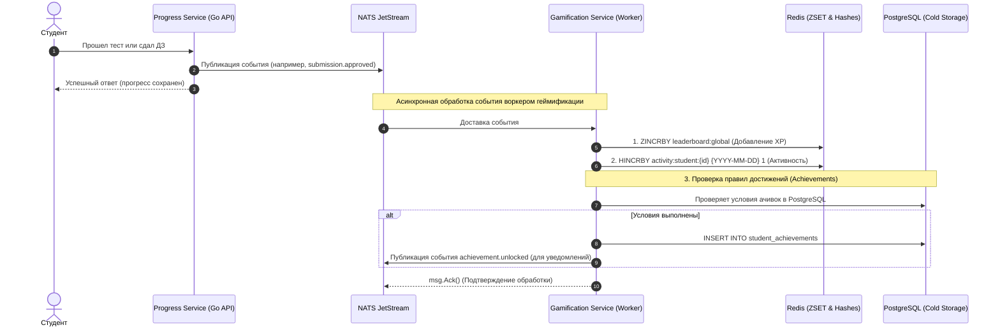

# Асинхронный Движок Геймификации, Лидербордов и Календаря Активности

Геймификация и визуализация прогресса — ключевые факторы удержания студентов (Retention) в онлайн-образовании. Для исключения дополнительной транзакционной нагрузки на основную базу данных успеваемости PostgreSQL, все операции по начислению XP, выдаче наград и формированию живых рейтингов вынесены в асинхронный, событийно-ориентированный микросервис **Gamification Service**.

---

## 1. Схема Архитектуры и Потоков Данных

Взаимодействие компонентов происходит асинхронно через шину NATS JetStream.



---

## 2. Модель Данных PostgreSQL (Achievements & Activity Cold Storage)

В реляционной СУБД хранятся шаблоны достижений, факты получения наград студентами и архивные (холодные) агрегированные данные о ежедневной активности.

```sql
-- 1. Справочник шаблонов достижений (ачивок)
CREATE TABLE achievements (
    id UUID PRIMARY KEY DEFAULT uuid_generate_v4(),
    title VARCHAR(150) NOT NULL,
    description TEXT NOT NULL,
    badge_icon_key VARCHAR(100) NOT NULL, -- Ключ иконки в S3
    condition_type VARCHAR(50) NOT NULL, -- 'lessons_completed', 'tests_passed_perfect', 'consecutive_days'
    target_value INT NOT NULL, -- Целевое значение для выполнения правила
    xp_reward INT NOT NULL DEFAULT 0, -- Бонусные очки опыта
    created_at TIMESTAMP WITH TIME ZONE NOT NULL DEFAULT CURRENT_TIMESTAMP
);

-- 2. Таблица связи: Выданные студентам достижения
CREATE TABLE student_achievements (
    student_id UUID NOT NULL,
    achievement_id UUID NOT NULL REFERENCES achievements(id) ON DELETE CASCADE,
    unlocked_at TIMESTAMP WITH TIME ZONE NOT NULL DEFAULT CURRENT_TIMESTAMP,
    PRIMARY KEY (student_id, achievement_id)
);

-- 3. Таблица холодного хранения ежедневной активности (GitHub-style calendar archive)
CREATE TABLE student_daily_activity (
    student_id UUID NOT NULL,
    activity_date DATE NOT NULL, -- День активности в формате YYYY-MM-DD
    activity_count INT NOT NULL DEFAULT 0, -- Количество завершенных действий за день
    xp_earned INT NOT NULL DEFAULT 0, -- Очки опыта, заработанные за этот день
    PRIMARY KEY (student_id, activity_date)
);

CREATE INDEX idx_student_activity_date ON student_daily_activity(student_id, activity_date);
```

---

## 3. Живые Лидерборды на базе Redis Sorted Sets (ZSET)

Для обеспечения субмиллисекундного времени отклика при отображении рейтингов используется структура данных **Redis Sorted Set (ZSET)**. В ZSET каждый студент идентифицируется своим `student_id` (member), а очками опыта XP выступает `score`.

### 3.1. Структура ключей Redis ZSET:
*   Глобальный рейтинг (все студенты платформы): `leaderboard:global`
*   Рейтинг внутри конкретного потока (когорты): `leaderboard:cohort:{cohort_id}`

### 3.2. Алгоритм управления и запросов:

*   **Начисление очков опыта (XP) студенту:**
    При получении очередных +100 XP воркер выполняет команду инкрементирования значения в глобальном и когортном ZSET:
    ```bash
    ZINCRBY leaderboard:global 100 "student-uuid-1"
    ZINCRBY leaderboard:cohort:cohort-uuid-abc 100 "student-uuid-1"
    ```

*   **Получение ТОП-10 студентов потока (для виджета рейтинга):**
    Бэкенд извлекает участников с максимальным количеством очков:
    ```bash
    ZREVRANGE leaderboard:cohort:cohort-uuid-abc 0 9 WITHSCORES
    ```

*   **Определение текущего места студента на платформе:**
    Чтобы показать студенту: *"Вы находитесь на 42 месте из 10,000"*, выполняются O(log N) запросы:
    ```bash
    # Узнаем ранг (позицию с конца, 0-индексировано, прибавляем 1)
    ZREVRANK leaderboard:global "student-uuid-1"
    # Узнаем точное количество очков
    ZSCORE leaderboard:global "student-uuid-1"
    ```

---

## 4. Календарь Активности (GitHub-style Daily Heatmap)

Календарь активности отображает сетку дней за год, закрашивая каждый день в оттенки зеленого цвета в зависимости от интенсивности обучения студента.

### 4.1. Архитектура Горячего Кэша (Redis Hashes)
Выполнение SQL-запроса `GROUP BY DATE` по миллионам записей логов при каждом открытии личного кабинета создаст чрезмерную нагрузку на дисковую подсистему PostgreSQL. 

Вместо этого текущий год активности студента кэшируется в **Redis Hash** под ключом:
`activity:student:{student_id}`

Внутри хэша полями выступают даты в формате `YYYY-MM-DD`, а значениями — счетчик действий за этот день.

*   **Запись активности (при просмотре видео / сдачи теста / аппруве ДЗ):**
    Воркер атомарно увеличивает счетчик активности за сегодня на 1:
    ```bash
    HINCRBY activity:student:student-uuid-1 "2026-05-23" 1
    ```
    *Срок жизни (TTL):* Для оптимизации памяти Redis, хэш текущего года имеет TTL 365 дней.

*   **Чтение календаря (отрисовка виджета в UI):**
    Бэкенд запрашивает весь кэшированный год активности студента за один O(N) вызов, где N — количество дней в году (максимум 366 полей):
    ```bash
    HGETALL activity:student:student-uuid-1
    ```
    Полученный JSON вида `{"2026-05-20": "3", "2026-05-23": "1"}` мгновенно передается на фронтенд за <1мс.

### 4.2. Асинхронный сброс в PostgreSQL (Cold Storage Flusher)
Для надежного долговременного хранения истории активности раз в сутки (в 03:00 по серверному времени) запускается фоновая Cron Job утилита, которая переносит данные вчерашнего дня из Redis Hashes в таблицу `student_daily_activity` с помощью пакетного `UPSERT`.

---

## 5. Реализация Воркера Начисления Очков в Gamification Service

Пример кода Go-воркера `GamificationWorker`, обрабатывающего события завершения компонентов урока и обновляющего кэши лидербордов и активности:

```go
package workers

import (
	"context"
	"encoding/json"
	"fmt"
	"time"

	"github.com/go-redis/redis/v8"
	"github.com/nats-io/nats.go"
)

type LessonCompletedEvent struct {
	StudentID string `json:"student_id"`
	CohortID  string `json:"cohort_id"`
	LessonID  string `json:"lesson_id"`
	XPCount   int    `json:"xp_count"` // Например, 50 XP
}

type GamificationWorker struct {
	rdb *redis.Client
}

func NewGamificationWorker(rdb *redis.Client) *GamificationWorker {
	return &GamificationWorker{rdb: rdb}
}

// HandleLessonCompleted обрабатывает события завершения урока из NATS JetStream
func (w *GamificationWorker) HandleLessonCompleted(msg *nats.Msg) {
	ctx, cancel := context.WithTimeout(context.Background(), 5*time.Second)
	defer cancel()

	var event LessonCompletedEvent
	if err := json.Unmarshal(msg.Data, &event); err != nil {
		msg.Term() // Fatal error: некорректный формат данных
		return
	}

	today := time.Now().Format("2006-01-02")
	pipe := w.rdb.Pipeline()

	// 1. Увеличиваем глобальный и когортный рейтинг (ZSET)
	globalKey := "leaderboard:global"
	cohortKey := fmt.Sprintf("leaderboard:cohort:%s", event.CohortID)
	pipe.ZIncrBy(ctx, globalKey, float64(event.XPCount), event.StudentID)
	pipe.ZIncrBy(ctx, cohortKey, float64(event.XPCount), event.StudentID)

	// 2. Увеличиваем счетчик календаря активности за сегодня (Hash)
	activityKey := fmt.Sprintf("activity:student:%s", event.StudentID)
	pipe.HIncrBy(ctx, activityKey, today, 1)
	pipe.Expire(ctx, activityKey, 365*24*time.Hour) // Продлеваем TTL до года

	// 3. Выполняем пакет транзакций в Redis за один сетевой запрос
	_, err := pipe.Exec(ctx)
	if err != nil {
		msg.Nak() // Transient error: повторяем попытку
		return
	}

	// 4. Логика проверки ачивок (Achievements Evaluation)
	// Воркер вызывает репозиторий бэкенда для сверки правил выдачи наград.
	// ... (вынесено в транзакционный SQL слой) ...

	msg.Ack() // Событие успешно обработано
}
```
