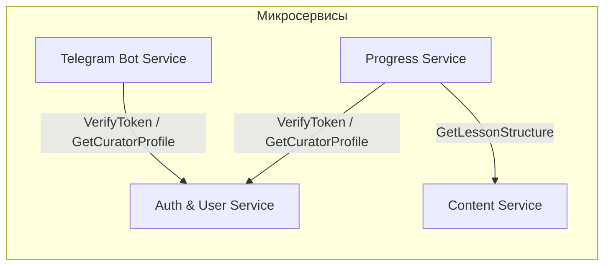

# Спецификация межсервисного gRPC-взаимодействия (Protobuf-контракты)

Для обеспечения строгого типизированного синхронного взаимодействия с субмиллисекундными задержками в микросервисной архитектуре **MathalamaEdu** используется протокол **gRPC** поверх **HTTP/2**. 

Все контракты сообщений и интерфейсы описаны в формате **Protocol Buffers v3** (Protobuf).

---

## 1. Схема межсервисного gRPC-трафика



---

## 2. Контракт службы авторизации и пользователей (`auth.proto`)

Этот контракт обеспечивает проверку подлинности сессий (JWT) и получение авторизационных профилей кураторов и студентов.

```protobuf
syntax = "proto3";

package mathalama.auth.v1;

option go_package = "mathalama/auth/v1;authv1";

import "google/protobuf/timestamp.proto";

// AuthService предоставляет методы для аутентификации и авторизации запросов
service AuthService {
  // VerifyToken проверяет JWT токен и возвращает метаданные пользователя
  rpc VerifyToken (VerifyTokenRequest) returns (VerifyTokenResponse);

  // GetCuratorProfile возвращает детальный профиль куратора по его Telegram Chat ID
  rpc GetCuratorProfile (GetCuratorProfileRequest) returns (GetCuratorProfileResponse);
}

message VerifyTokenRequest {
  // Сырой JWT токен из HTTP заголовка Authorization (без префикса Bearer)
  // Валидация: обязательное поле, длина от 10 до 2048 символов
  string token = 1;
}

message VerifyTokenResponse {
  // Уникальный идентификатор пользователя
  string user_id = 1;
  // Роль пользователя: student, curator, admin
  string role = 2;
  // Статус учетной записи: active, inactive, deleted_scheduled
  string status = 3;
  // Срок истечения действия JWT
  google.protobuf.Timestamp expires_at = 4;
}

message GetCuratorProfileRequest {
  // Идентификатор чата в Telegram, полученный из вебхука Bot API
  // Валидация: обязательное поле, только числовой формат в строке
  string telegram_chat_id = 1;
}

message GetCuratorProfileResponse {
  // Уникальный идентификатор куратора в системе
  string curator_id = 1;
  // Email куратора
  string email = 2;
  // Имя
  string first_name = 3;
  // Фамилия
  string last_name = 4;
  // Список идентификаторов когорт (групп), которые ведет этот куратор
  repeated string cohort_ids = 5;
  // Время последней синхронизации сессии с Redis
  google.protobuf.Timestamp cached_at = 6;
}
```

---

## 3. Контракт службы управления контентом (`content.proto`)

Этот контракт используется другими микросервисами (например, сервисом успеваемости `Progress Service`) для сверки структуры уроков и ограничений.

```protobuf
syntax = "proto3";

package mathalama.content.v1;

option go_package = "mathalama/content/v1;contentv1";

import "google/protobuf/timestamp.proto";

// ContentService управляет курсами, модулями, уроками и тестами
service ContentService {
  // GetLessonStructure возвращает структуру и требования конкретного урока
  rpc GetLessonStructure (GetLessonStructureRequest) returns (GetLessonStructureResponse);

  // ValidateCourseAccess сверяет, принадлежит ли урок указанному курсу
  rpc ValidateCourseAccess (ValidateCourseAccessRequest) returns (ValidateCourseAccessResponse);
}

message GetLessonStructureRequest {
  // Уникальный ID урока
  string lesson_id = 1;
}

message GetLessonStructureResponse {
  // ID урока
  string lesson_id = 1;
  // ID модуля, к которому принадлежит урок
  string module_id = 2;
  // ID курса
  string course_id = 3;
  // Флаг, требующий прохождения теста
  bool has_test = 4;
  // Флаг, требующий сдачи PDF конспекта
  bool has_assignment = 5;
  // Абсолютный порядковый номер урока в курсе (для O(1) переходов)
  int32 absolute_order = 6;
  // ID следующего урока по порядку (если есть)
  string next_lesson_id = 7;
}

message ValidateCourseAccessRequest {
  // ID проверяемого урока
  string lesson_id = 1;
  // ID целевого курса
  string course_id = 2;
}

message ValidateCourseAccessResponse {
  // Доступность: true, если урок входит в структуру данного курса
  bool is_valid = 1;
}
```

---

## 4. Контракт службы успеваемости и прогресса (`progress.proto`)

Позволяет другим микросервисам (например, API Gateway или Telegram Bot) запрашивать консолидированные данные о прохождении обучения.

```protobuf
syntax = "proto3";

package mathalama.progress.v1;

option go_package = "mathalama/progress/v1;progressv1";

import "google/protobuf/timestamp.proto";

// ProgressService управляет отслеживанием успеваемости студентов
service ProgressService {
  // GetStudentProgress возвращает агрегированный прогресс студента по курсу
  rpc GetStudentProgress (GetStudentProgressRequest) returns (GetStudentProgressResponse);
}

message GetStudentProgressRequest {
  // ID студента
  string student_id = 1;
  // ID курса
  string course_id = 2;
}

message LessonProgressDetail {
  // ID урока
  string lesson_id = 1;
  // Текущий статус: locked, unlocked, completed
  string status = 2;
  // Время открытия урока (может быть пустым, если locked)
  google.protobuf.Timestamp unlocked_at = 3;
  // Время завершения урока (может быть пустым)
  google.protobuf.Timestamp completed_at = 4;
  // Результат прохождения теста (процент правильных ответов 0-100)
  int32 test_score = 5;
  // Ссылка на сданный PDF конспект (если есть)
  string assignment_file_url = 6;
}

message GetStudentProgressResponse {
  // ID студента
  string student_id = 1;
  // ID курса
  string course_id = 2;
  // Процент завершения курса (0-100%)
  int32 completion_percentage = 3;
  // Количество завершенных уроков
  int32 completed_lessons_count = 4;
  // Всего уроков в курсе
  int32 total_lessons_count = 5;
  // Подробный прогресс по каждому уроку
  repeated LessonProgressDetail lessons = 6;
}
```

---

## 5. Правила генерации кода из Protobuf

Для автоматической кодогенерации из описанных контрактов в Go-проекте используется утилита **`buf`** (`buf.build`).

### Файл конфигурации генератора (`buf.gen.yaml`):
```yaml
version: v1
plugins:
  - plugin: go
    out: internal/platform/grpc/gen
    opt: paths=source_relative
  - plugin: go-grpc
    out: internal/platform/grpc/gen
    opt: paths=source_relative
```

### Команда кодогенерации:
```bash
# Генерация заглушек клиента и сервера в Go
buf generate
```
