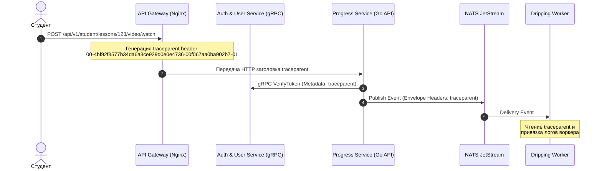

# Стандарты Сквозной Наблюдаемости (Observability, Distributed Tracing & SLOs)

В высоконагруженной распределенной системе **MathalamaEdu**, состоящей из множества асинхронных Go-микросервисов, распределенной шины NATS и кэша Redis, обнаружение узких мест и отладка невозможны без единого стандарта наблюдаемости (Observability). 

Стандарт базируется на трех столпах: **Сквозная трассировка (Tracing)**, **Сбор метрик (Metrics)** и **Показатели надежности (SLOs)**.

---

## 1. Сквозная распределенная трассировка (Distributed Tracing)

Мы используем стандарт **OpenTelemetry** и спецификацию **W3C Trace Context** для отслеживания сквозного пути пользовательского запроса от клика в веб-интерфейсе или Telegram до финальной записи в базу данных.



### 1.1. Стандарт заголовка Трассировки (W3C traceparent)
Сквозной идентификатор передается в заголовке `traceparent` формата:
`00-{trace_id}-{parent_id}-{trace_flags}`

*   **`trace_id` (32 шестнадцатеричных символа):** Единый уникальный ID всей распределенной транзакции.
*   **`parent_id` (16 шестнадцатеричных символов):** ID родительского спана (шага).
*   **`trace_flags` (2 символа):** Флаги трассировки (например, `01` — принудительное сэмплирование спана).

---

### 1.2. Пропагация (передача) контекста трассировки

#### А. Передача по gRPC (Go Client $\rightarrow$ gRPC Server):
Контекст трассировки упаковывается в gRPC Metadata:
```go
package tracing

import (
	"context"
	"google.golang.org/grpc/metadata"
)

// InjectgRPCContext вставляет traceparent из context.Context в метаданные gRPC
func InjectgRPCContext(ctx context.Context) context.Context {
	traceParent := getTraceParentFromCtx(ctx) // Извлечение из OpenTelemetry
	md := metadata.Pairs("traceparent", traceParent)
	return metadata.NewOutgoingContext(ctx, md)
}
```

#### Б. Передача в сообщения NATS JetStream:
Контекст трассировки передается непосредственно в заголовках (Headers) сообщения NATS:
```go
package nats

import (
	"context"
	"github.com/nats-io/nats.go"
)

// PublishWithTracing публикует событие в NATS, сохраняя traceparent
func PublishWithTracing(ctx context.Context, js nats.JetStreamContext, subj string, data []byte) error {
	msg := nats.NewMsg(subj)
	msg.Data = data
	
	// Внедряем заголовок трассировки
	traceParent := getTraceParentFromCtx(ctx)
	msg.Header.Set("traceparent", traceParent)
	
	_, err := js.PublishMsg(msg)
	return err
}
```

---

## 2. Каталог ключевых метрик Prometheus (KPI Metrics)

Для мониторинга здоровья инфраструктуры и сервисов Prometheus собирает метрики, категоризированные по четырем золотым сигналам (Latency, Traffic, Errors, Saturation).

### 2.1. Метрики очередей NATS JetStream
*   `nats_consumer_lag_messages` (Gauge) — Количество необработанных сообщений в стриме для конкретного консьюмера (Lag).
    *   *Критический алерт:* `nats_consumer_lag_messages > 10000` в течение 5 минут.
*   `nats_delivery_attempts_total` (Counter) — Количество повторных доставок сообщения (индикатор Transient/Fatal ошибок).

### 2.2. Метрики Redis (Progress Write-Behind Cache)
*   `redis_cache_hit_ratio` (Gauge) — Процент попадания в кэш при гибридном чтении (Hybrid Read Merge).
*   `redis_dirty_keys_count` (Gauge) — Размер множества `progress:dirty_students` (накопившийся объем не сброшенного кэша).
    *   *Критический алерт:* `redis_dirty_keys_count > 50000` (воркер сброса `CacheFlusher` завис или не справляется с нагрузкой).

### 2.3. Метрики PostgreSQL (База данных)
*   `db_bulk_upsert_latency_seconds` (Histogram) — Время выполнения пачки Bulk UPSERT транзакций флушера.
*   `db_lock_wait_timeout_total` (Counter) — Количество таймаутов блокировок строк PostgreSQL.
*   `db_open_connections` (Gauge) — Процент утилизации пула соединений БД.

---

## 3. Метрики надежности и целевые показатели (SLI / SLO / SLA)

Мы устанавливаем строгие целевые показатели для ключевых микросервисов для отслеживания бюджета ошибок (Error Budget):

| Микросервис | Метрика уровня обслуживания (SLI) | Целевой показатель надежности (SLO) | Допустимый бюджет ошибок (в месяц) |
| :--- | :--- | :--- | :--- |
| **Auth & User Service** | Доступность API VerifyToken | **$\ge 99.99\%$** (Успешные HTTP 2xx/3xx ответы) | $\le 4.3$ минуты простоя |
| **Auth & User Service** | Задержка (Latency) VerifyToken | **$\le 10$ мс** для 99% (p99) gRPC-запросов | Не более 1% медленных запросов |
| **Progress Service** | Задержка асинхронной отметки видео | **$\le 2$ мс** (p95) при записи видео-пинга в Redis | Не более 5% просадок |
| **Progress Service** | Задержка гибридного чтения (Merge) | **$\le 80$ мс** (p99) для тяжелых сборных запросов | Процент медленных ответов $\le 1\%$ |
| **Telegram Bot Service** | Задержка обработки входящих вебхуков | **$\le 50$ мс** (p99) благодаря Redis-сессиям | Допускается $\le 0.5\%$ выбросов latency |
| **Dripping Worker** | Время открытия следующего урока | **$\le 1.5$ с** с момента ACK домена | Отставание открытия урока $\le 1\%$ |

---

## 4. Архитектура Алертинга (Alerting Rules)

Инженеры SRE настраивают оповещения в Prometheus Alertmanager на основе SLO-показателей. 

Пример критического правила алертинга при истощении бюджета ошибок (Error Budget Burn Rate):
```yaml
groups:
  - name: mathalama_slo_alerts
    rules:
      - alert: AuthVerifyTokenHighErrorRate
        expr: sum(rate(grpc_server_handled_total{grpc_service="auth.v1.AuthService",grpc_code!="OK"}[5m])) 
              / sum(rate(grpc_server_handled_total{grpc_service="auth.v1.AuthService"}[5m])) * 100 > 0.1
        for: 2m
        labels:
          severity: critical
        annotations:
          summary: "Истощение бюджета ошибок AuthService!"
          description: "Процент ошибок gRPC-метода VerifyToken составляет {{ $value }}% за последние 5 минут."
```
