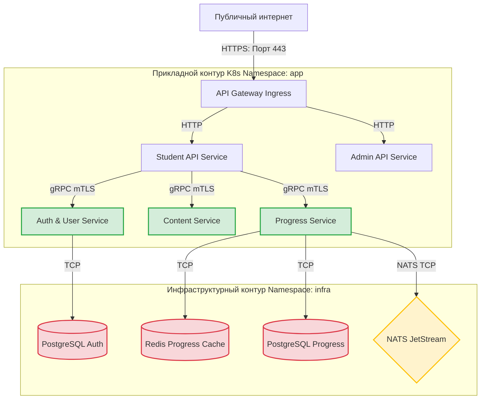

# Сетевая Безопасность, Сегментация и Управление Секретами (Security Architecture)

Безопасность персональных данных студентов, защита интеллектуальной собственности (видеоконтента) и изоляция внутренней инфраструктуры платформы **MathalamaEdu** регламентируются строгим сетевым периметром и автоматизированным управлением секретами.

---

## 1. Архитектура Сетевой Сегментации и Периметра

Все микросервисы и инфраструктурные компоненты MathalamaEdu развертываются внутри изолированного кластера Kubernetes. Внешний доступ имеет исключительно **API Gateway (Nginx / Ingress Controller)**.



---

## 2. Kubernetes Network Policies (Сетевая Изоляция)

Для предотвращения бокового перемещения злоумышленника (Lateral Movement) при компрометации веб-сервиса базы данных и брокеры NATS изолируются с помощью **Kubernetes Network Policies**.

### 2.1. Сетевое правило для базы данных PostgreSQL (`postgres-network-policy.yaml`)
Это правило разрешает входящий TCP-трафик на порт `5432` строго из подов бэкенд-сервисов:

```yaml
apiVersion: networking.k8s.io/v1
kind: NetworkPolicy
metadata:
  name: postgres-allow-backend-only
  namespace: infra
spec:
  podSelector:
    matchLabels:
      app: postgres-auth
  policyTypes:
    - Ingress
  ingress:
    - from:
        - namespaceSelector:
            matchLabels:
              kubernetes.io/metadata.name: app
          podSelector:
            matchLabels:
              app: auth-service
      ports:
        - protocol: TCP
          port: 5432
```

---

## 3. Mutual TLS (mTLS) для gRPC-взаимодействия

Все синхронные вызовы между микросервисами по протоколу gRPC внутри периметра обязаны шифроваться с двусторонней аутентификацией по сертификатам (**mTLS**). В качестве стандарта используется встроенная интеграция Service Mesh (Linkerd / Istio) либо нативная конфигурация Go `crypto/tls`.

### Шаблон инициализации безопасного gRPC-клиента в Go:
```go
package security

import (
	"crypto/tls"
	"crypto/x509"
	"io/ioutil"
	
	"google.golang.org/grpc"
	"google.golang.org/grpc/credentials"
)

// LoadmTLSCredentials загружает CA, сертификат клиента и приватный ключ для безопасного gRPC
func LoadmTLSCredentials(caCertPath, clientCertPath, clientKeyPath string) (credentials.TransportCredentials, error) {
	// 1. Загружаем сертификат центра сертификации (CA)
	pemBlock, err := ioutil.ReadFile(caCertPath)
	if err != nil {
		return nil, err
	}
	
	certPool := x509.NewCertPool()
	if !certPool.AppendCertsFromPEM(pemBlock) {
		return nil, err
	}
	
	// 2. Загружаем пару ключ/сертификат клиента
	clientCert, err := tls.LoadX509KeyPair(clientCertPath, clientKeyPath)
	if err != nil {
		return nil, err
	}
	
	// 3. Создаем TLS-конфигурацию с взаимной проверкой
	config := &tls.Config{
		Certificates: []tls.Certificate{clientCert},
		RootCAs:      certPool,
		MinVersion:   tls.VersionTLS13, // Только TLS 1.3
	}
	
	return credentials.NewTLS(config), nil
}
```

---

## 4. Управление секретами и динамическая ротация (HashiCorp Vault)

Хранение паролей в конфигурационных файлах или переменных окружения запрещено. Управление секретами MathalamaEdu централизовано в **HashiCorp Vault**.

### 4.1. Автоматическая ротация JWT-ключей подписи
Для минимизации последствий утечки ключа подписи JWT сессий (symmetric HS256 или asymmetric RS256) в Auth Service внедряется динамическая ротация:

1. **Vault Transit Engine:** Генерация JWT подписей выполняется непосредственно через криптографические функции HashiCorp Vault. Ключ подписи никогда не покидает память Vault.
2. **Key Rotation Job:** Каждые **7 дней** крон-задача в Vault производит ротацию ключа (`vault write -f transit/keys/jwt-signing-key/rotate`).
3. **Обратная совместимость:** При валидации токенов система поддерживает кэш публичных ключей (JWKS) текущего и предыдущего поколений (Grace Period 48 часов) для бесшовного перехода пользователей.

### 4.2. Динамические доступы к PostgreSQL
Auth Service и Progress Service запрашивают временные реквизиты (Dynamic Credentials) к PostgreSQL у Vault со сроком жизни (TTL) 1 час:
```bash
# Пример запроса временных доступов из Vault
vault read database/creds/auth-service-role
```
Vault самостоятельно создает уникального временного SQL-пользователя в PostgreSQL и удаляет его по истечении срока жизни.

---

## 5. Чек-лист соответствия GDPR (Compliance Checklist)

Для обеспечения строгого соблюдения GDPR в MathalamaEdu выполняются следующие требования:

*   `[x]` **Encryption in Transit:** Весь входящий HTTP трафик защищен TLS 1.3 на API Gateway. Межсервисный gRPC трафик шифруется через mTLS.
*   `[x]` **Pseudonymization (Псевдонимизация):** Во всех сервисах логирования персональные данные (Email, ФИО) маскируются. Трассировка `correlation_id` не содержит личных данных.
*   `[x]` **Data Isolation:** Персональные данные пользователей изолированы в СУБД `Auth Service`. Другие сервисы (Progress, Content) оперируют исключительно безликими UUID (`student_id`, `cohort_id`).
*   `[x]` **GDPR Deletion Pipeline:** Асинхронное удаление пользователя (событие `user.gdpr_delete_requested`) гарантирует полное физическое удаление или анонимизацию данных в базах успеваемости и хранилище S3 в течение 30 дней.
