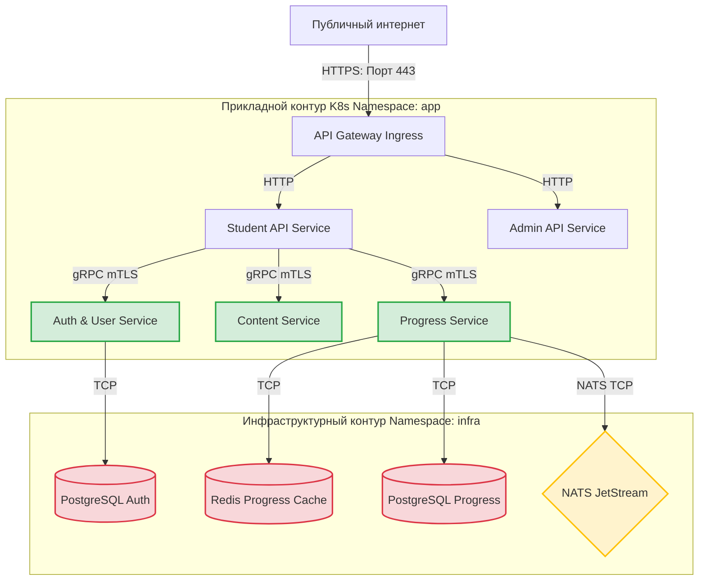
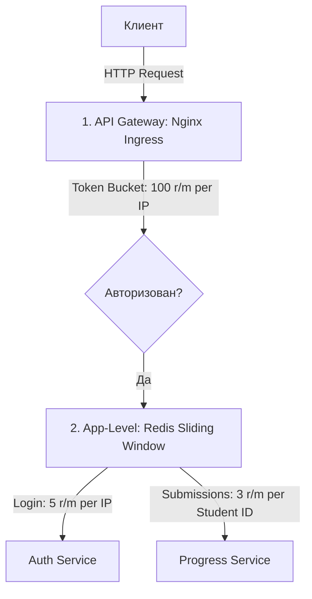

# Сетевая Безопасность, Сегментация и Управление Секретами (Security Architecture)

Безопасность персональных данных студентов, защита интеллектуальной собственности (видеоконтента) и изоляция внутренней инфраструктуры платформы **MathalamaEdu** регламентируются строгим сетевым периметром и автоматизированным управлением секретами.

---

## 1. Архитектура Сетевой Сегментации и Периметра

Все микросервисы и инфраструктурные компоненты MathalamaEdu развертываются внутри изолированного кластера Kubernetes. Внешний доступ имеет исключительно **API Gateway (Nginx / Ingress Controller)**.



---

## 2. Kubernetes Network Policies (Сетевая Изоляция)

Для предотвращения бокового перемещения злоумышленника (Lateral Movement) при компрометации веб-сервиса базы данных и брокеры NATS изолируются с помощью **Kubernetes Network Policies**.

### 2.1. Сетевое правило для базы данных PostgreSQL (`postgres-network-policy.yaml`)
Это правило разрешает входящий TCP-трафик на порт `5432` строго из подов бэкенд-сервисов:

```yaml
apiVersion: networking.k8s.io/v1
kind: NetworkPolicy
metadata:
  name: postgres-allow-backend-only
  namespace: infra
spec:
  podSelector:
    matchLabels:
      app: postgres-auth
  policyTypes:
    - Ingress
  ingress:
    - from:
        - namespaceSelector:
            matchLabels:
              kubernetes.io/metadata.name: app
          podSelector:
            matchLabels:
              app: auth-service
      ports:
        - protocol: TCP
          port: 5432
```

---

## 3. Mutual TLS (mTLS) для gRPC-взаимодействия

Все синхронные вызовы между микросервисами по протоколу gRPC внутри периметра обязаны шифроваться с двусторонней аутентификацией по сертификатам (**mTLS**). В качестве стандарта используется встроенная интеграция Service Mesh (Linkerd / Istio) либо нативная конфигурация Go `crypto/tls`.

### Шаблон инициализации безопасного gRPC-клиента в Go:
```go
package security

import (
	"crypto/tls"
	"crypto/x509"
	"io/ioutil"
	
	"google.golang.org/grpc"
	"google.golang.org/grpc/credentials"
)

// LoadmTLSCredentials загружает CA, сертификат клиента и приватный ключ для безопасного gRPC
func LoadmTLSCredentials(caCertPath, clientCertPath, clientKeyPath string) (credentials.TransportCredentials, error) {
	// 1. Загружаем сертификат центра сертификации (CA)
	pemBlock, err := ioutil.ReadFile(caCertPath)
	if err != nil {
		return nil, err
	}
	
	certPool := x509.NewCertPool()
	if !certPool.AppendCertsFromPEM(pemBlock) {
		return nil, err
	}
	
	// 2. Загружаем пару ключ/сертификат клиента
	clientCert, err := tls.LoadX509KeyPair(clientCertPath, clientKeyPath)
	if err != nil {
		return nil, err
	}
	
	// 3. Создаем TLS-конфигурацию с взаимной проверкой
	config := &tls.Config{
		Certificates: []tls.Certificate{clientCert},
		RootCAs:      certPool,
		MinVersion:   tls.VersionTLS13, // Только TLS 1.3
	}
	
	return credentials.NewTLS(config), nil
}
```

---

## 4. Управление секретами и динамическая ротация (HashiCorp Vault)

Хранение паролей в конфигурационных файлах или переменных окружения запрещено. Управление секретами MathalamaEdu централизовано в **HashiCorp Vault**.

### 4.1. Автоматическая ротация JWT-ключей подписи
Для минимизации последствий утечки приватного ключа подписи JWT сессий (асимметричный RS256/EdDSA) в Auth Service внедряется динамическая ротация:

1. **Vault Transit Engine:** Генерация JWT подписей выполняется непосредственно через криптографические функции HashiCorp Vault. Ключ подписи никогда не покидает память Vault.
2. **Key Rotation Job:** Каждые **7 дней** крон-задача в Vault производит ротацию ключа (`vault write -f transit/keys/jwt-signing-key/rotate`).
3. **Обратная совместимость:** При валидации токенов система поддерживает кэш публичных ключей (JWKS) текущего и предыдущего поколений (Grace Period 48 часов) для бесшовного перехода пользователей.

### 4.2. Динамические доступы к PostgreSQL
Auth Service и Progress Service запрашивают временные реквизиты (Dynamic Credentials) к PostgreSQL у Vault со сроком жизни (TTL) 1 час:
```bash
# Пример запроса временных доступов из Vault
vault read database/creds/auth-service-role
```
Vault самостоятельно создает уникального временного SQL-пользователя в PostgreSQL и удаляет его по истечении срока жизни.

---

## 5. Чек-лист соответствия GDPR (Compliance Checklist)

Для обеспечения строгого соблюдения GDPR в MathalamaEdu выполняются следующие требования:

*   `[x]` **Encryption in Transit:** Весь входящий HTTP трафик защищен TLS 1.3 на API Gateway. Межсервисный gRPC трафик шифруется через mTLS.
*   `[x]` **Pseudonymization (Псевдонимизация):** Во всех сервисах логирования персональные данные (Email, ФИО) маскируются. Трассировка `correlation_id` не содержит личных данных.
*   `[x]` **Data Isolation:** Персональные данные пользователей изолированы в СУБД `Auth Service`. Другие сервисы (Progress, Content) оперируют исключительно безликими UUID (`student_id`, `cohort_id`).
*   `[x]` **GDPR Deletion Pipeline:** Асинхронное удаление пользователя (событие `user.gdpr_delete_requested`) гарантирует полное физическое удаление или анонимизацию данных в базах успеваемости и хранилище S3 в течение 30 дней.

---

## 6. Ограничение частоты запросов (API Rate Limiting & DoS Protection)

Для предотвращения атак типа Brute-Force, исчерпания ресурсов S3-хранилища и снижения нагрузки на бэкенд в MathalamaEdu реализована **двухуровневая модель ограничения частоты запросов (Defense-in-Depth Rate Limiting)**.



### 6.1. Уровень 1: Глобальное ограничение на шлюзе (Nginx API Gateway)
На внешнем периметре API Gateway (Nginx Ingress Controller) ограничивает интенсивность трафика от одного источника (IP-адреса) с помощью алгоритма **Token Bucket** (`ngx_http_limit_req_module`).
*   **Глобальная зона:** 100 запросов в минуту с возможностью кратковременного всплеска (burst) до 20 запросов.
*   **Конфигурация Nginx Ingress (`ingress-config.yaml`):**
    ```yaml
    apiVersion: networking.k8s.io/v1
    kind: Ingress
    metadata:
      name: lms-ingress
      annotations:
        nginx.ingress.kubernetes.io/limit-rate: "512k" # Ограничение скорости скачивания контента
        nginx.ingress.kubernetes.io/limit-connections: "20" # Максимум 20 одновременных TCP-соединений с одного IP
        nginx.ingress.kubernetes.io/limit-rpm: "100" # Лимит в 100 запросов в минуту
        nginx.ingress.kubernetes.io/limit-burst-multiplier: "5" # Разрешаем burst до 20 запросов
    ```

### 6.2. Уровень 2: Прикладное ограничение (Redis Sliding Window Rate Limiter)
Для чувствительных бизнес-сценариев используется умный распределенный лимитатор на уровне приложения с хранением состояния в Redis. Алгоритм **Sliding Window (Скользящее окно)** на базе упорядоченных множеств (`ZSET`) предотвращает атаки на границах минут, которые часто обходят простой алгоритм Fixed Window.

*   **POST `/api/v1/auth/login` (Защита от Brute-Force):**
    *   **Лимит:** 5 запросов в минуту.
    *   **Ключ кэша:** `rate:login:{ip_address}`
*   **POST `/api/v1/student/lessons/{id}/submit` (Защита от спама файлами и перегрузки ClamAV/pdfcpu):**
    *   **Лимит:** 3 запроса в минуту.
    *   **Ключ кэша:** `rate:submit:{student_id}`

### 6.3. Алгоритм реализации Sliding Window в Go & Redis с использованием Lua-скрипта

Для обеспечения абсолютной атомарности операции, предотвращения race conditions в конкурентной среде и исключения неверного подсчета лимитов (когда запрос добавляется в ZSET до прохождения проверки), мы используем Redis **Lua-скрипт**. 

Lua-скрипт выполняется на сервере Redis атомарно в рамках одного потока, что гарантирует защиту от race conditions без использования тяжелых распределенных блокировок.

#### Lua-скрипт для Sliding Window Rate Limiter:
```lua
local key = KEYS[1]
local now = tonumber(ARGV[1])          -- Текущая метка времени в наносекундах
local window = tonumber(ARGV[2])       -- Размер окна в наносекундах
local limit = tonumber(ARGV[3])        -- Максимальный лимит запросов
local clear_before = now - window      -- Граница удаления старых записей

-- 1. Удаляем устаревшие запросы, вышедшие за пределы скользящего окна
redis.call('ZRemRangeByScore', key, '-inf', clear_before)

-- 2. Подсчитываем количество успешных запросов в текущем окне
local current_requests = redis.call('ZCard', key)

-- 3. Проверяем лимит
if current_requests < limit then
    -- Запрос разрешен: добавляем текущую попытку в ZSET
    redis.call('ZAdd', key, now, now)
    -- Устанавливаем TTL для автоматического удаления ключа из Redis
    local window_secs = math.ceil(window / 1e9)
    redis.call('Expire', key, window_secs)
    return {1, 0} -- {разрешено = true, retry_after = 0}
else
    -- Превышено: вычисляем время до освобождения старейшего слота в окне
    local oldest = redis.call('ZRange', key, 0, 0, 'WITHSCORES')
    local retry_after = 0
    if oldest and oldest[2] then
        local oldest_score = tonumber(oldest[2])
        retry_after = oldest_score + window - now
    else
        retry_after = window
    end
    return {0, retry_after} -- {разрешено = false, retry_after = задержка в наносекундах}
end
```

#### Пример Go-кода промежуточного ПО (Middleware):
```go
package middleware

import (
	"context"
	"net/http"
	"time"

	"github.com/go-redis/redis/v8"
)

// Lua-скрипт регистрируется один раз при старте приложения
var slidingWindowScript = redis.NewScript(`
	local key = KEYS[1]
	local now = tonumber(ARGV[1])
	local window = tonumber(ARGV[2])
	local limit = tonumber(ARGV[3])
	local clear_before = now - window

	redis.call('ZRemRangeByScore', key, '-inf', clear_before)
	local current_requests = redis.call('ZCard', key)

	if current_requests < limit then
		redis.call('ZAdd', key, now, now)
		local window_secs = math.ceil(window / 1e9)
		redis.call('Expire', key, window_secs)
		return {1, 0}
	else
		local oldest = redis.call('ZRange', key, 0, 0, 'WITHSCORES')
		local retry_after = 0
		if oldest and oldest[2] then
			local oldest_score = tonumber(oldest[2])
			retry_after = oldest_score + window - now
		else
			retry_after = window
		end
		return {0, retry_after}
	end
`)

type RateLimiter struct {
	rdb        *redis.Client
	limit      int64
	windowSecs int64
}

func NewRateLimiter(rdb *redis.Client, limit, windowSecs int64) *RateLimiter {
	return &RateLimiter{rdb: rdb, limit: limit, windowSecs: windowSecs}
}

func (rl *RateLimiter) Limit(ctx context.Context, key string) (bool, time.Duration, error) {
	now := time.Now().UnixNano()
	windowNano := rl.windowSecs * int64(time.Second)

	// Выполняем Lua-скрипт в Redis атомарно
	res, err := slidingWindowScript.Run(ctx, rl.rdb, []string{key}, now, windowNano, rl.limit).Result()
	if err != nil {
		return false, 0, err
	}

	results := res.([]interface{})
	allowed := results[0].(int64) == 1
	retryAfterNano := results[1].(int64)

	var retryAfter time.Duration
	if retryAfterNano > 0 {
		retryAfter = time.Duration(retryAfterNano) * time.Nanosecond
	}

	return allowed, retryAfter, nil
}
```
