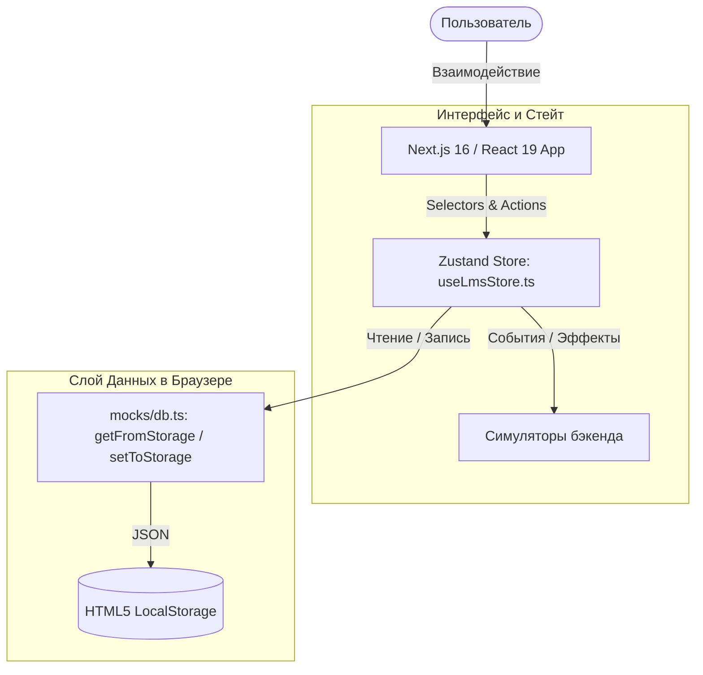

# Архитектура MathalamaEdu: Client-Side Mock-платформа (v1)

Этот документ описывает актуальную архитектуру первой версии (v1) образовательной платформы **MathalamaEdu**. 

На текущем этапе проект реализован как высокотехнологичное автономное клиентское веб-приложение (Single Page Application), работающее полностью в браузере. Все базы данных, состояния авторизации, прогресс обучения и асинхронные цепочки (включая проверку домашних работ куратором) полностью симулируются на стороне клиента.

---

## 1. Общие архитектурные принципы

Приложение разработано по принципу **Frontend-First / Serverless Mock**. Это позволило спроектировать и протестировать все сценарии пользовательского опыта (UX) и интерактивные анимации до подключения реального бэкенда.

---

## 2. Ключевые компоненты системы

### 2.1. Next.js 16 (App Router)
Управляет маршрутизацией и макетами страниц:
*   **Корневой роут `/`:** Определяет статус авторизации и делает мгновенный клиентский редирект на `/dashboard` или `/login`.
*   **Группа маршрутов `(dashboard)/`:** Объединяет защищенные разделы (`dashboard`, `courses`, `analytics`, `notifications`, `certificates`, `profile`, `settings`). Использует общий макет `layout.tsx` для предотвращения повторного монтирования бокового меню и сайдбара при навигации.
*   **Автономный роут `/login`:** Страница входа в систему с демонстрационными учетными данными (`student@example.com` / `password`).

### 2.2. Zustand Store (`useLmsStore.ts`)
Единый источник истины (Single Source of Truth) для всего приложения. Управляет:
*   Сессией пользователя (`token`, `role`, `studentName`).
*   Списком курсов и модулей.
*   Системой уведомлений (добавление, отметка о прочтении).
*   Заметками к лекциям и статусами интервального повторения.
*   Анимацией тостов (всплывающих сообщений).

### 2.3. Имитационный слой БД (`mocks/db.ts`)
Инициализирует базу данных в `localStorage` при первом запуске (заполняет демо-курсами по Go и Матанализу, уроками, вопросами к тестам) и предоставляет функции синхронизации:
*   `getFromStorage<T>(key, defaultValue)`: считывает JSON-структуру из локального хранилища.
*   `setToStorage<T>(key, value)`: сохраняет обновленные данные.

---

## 3. Симуляция сквозного цикла обучения (E2E-Flow)

Для тестирования сценариев обучения во фронтенде полностью реализована симуляция асинхронных бэкенд-операций:

1.  **Просмотр лекции и создание заметок:** При сохранении заметки к видео на определенном таймкоде, она записывается в массив `videoNotes` в `localStorage`, а студенту начисляется `+10 XP`.
2.  **Сдача тестов:** Компонент тестов сверяет выбранные индексы с правильными ответами, рассчитывает итоговый балл и сохраняет результат в базу. При успешной сдаче статус теста меняется на `passed: true`.
3.  **Загрузка PDF (ДЗ):**
    *   При загрузке PDF-файла запускается симуляция антивирусной проверки (ClamAV) с прогресс-баром.
    *   После завершения проверки статус работы переходит в состояние `pending` (На проверке).
    *   Запускается `setTimeout` на **6 секунд**, имитирующий Telegram-уведомление куратора и его последующий апрув.
    *   По истечении таймера статус ДЗ переходит в `approved` (Одобрено), начисляется `+100 XP`, и следующий урок в программе курса автоматически разблокируется (переходит в статус `unlocked`).

---

## 4. Оформление и дизайн-система

Интерфейс построен на базе **Bento UI** (плиточный дизайн) со следующими параметрами:
*   **Шрифты:** Geist Sans для интерфейсных текстов и Outfit для крупных акцентных заголовков.
*   **Скругления:** Bento-карточки имеют скругление `24px` (`var(--radius-bento)`) и внутренний отступ `1.5rem` (`24px`).
*   **Тема оформления:** Полная поддержка светлой и тёмной тем через CSS-переменные в [globals.css](file:///c:/Users/Admin/Desktop/mathalama.edu/app/src/app/globals.css). Переключение осуществляется через `document.documentElement.setAttribute('data-theme', theme)`.
