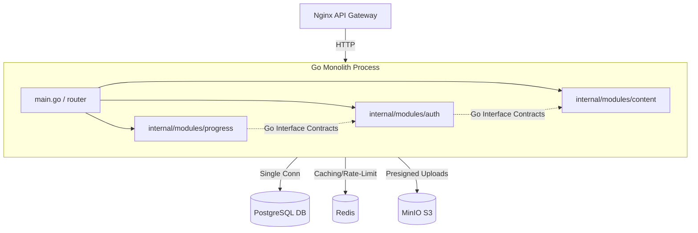

# Архитектура MVP: Модульный Монолит (v1)

Этот документ описывает архитектуру первой версии (MVP) образовательной платформы **MathalamaEdu**. 

Для ускорения разработки, упрощения CI/CD и снижения накладных расходов на инфраструктуру на старте проекта вместо 5 отдельных микросервисов и сложного технологического стека (gRPC, NATS JetStream, HashiCorp Vault, Redis write-behind) выбрана архитектура **модульного монолита** (Modular Monolith) на Go с единой СУБД PostgreSQL.

При этом в дизайне монолита заложены строгие доменные границы, что позволит беспрепятственно перейти к целевой микросервисной архитектуре (target-state, описанной в корневом `/docs`) по мере роста нагрузок и команды.

---

## 1. Системные принципы модульности

Монолит собирается в один исполняемый файл, но имеет строгое разделение кода на уровне Go-пакетов (модулей).

### 1.1. Правила изоляции модулей
1.  **Собственные папки (домены):** Каждый домен (`auth`, `content`, `progress`, `submissions`, `notifications`, `telegram`) живет в своем изолированном пакете внутри `/internal/modules/`.
2.  **Запрет прямых вызовов unexported-кода:** Общение между модулями происходит исключительно через экспортированные Go-интерфейсы (Contracts), определенные каждым модулем. Прямой импорт структур данных из чужого модуля запрещен.
3.  **Собственные структуры БД:** Каждый модуль имеет собственные структуры данных (Models), описывающие его таблицы. Совместное использование сущностей моделей запрещено.
4.  **Собственные DTO:** Обмен данными между модулями идет через простые структуры данных (DTO), описанные в контракте модуля.



---

## 2. Архитектура баз данных (Логическая изоляция)

Вместо обслуживания трех отдельных СУБД PostgreSQL на этапе MVP используется **один инстанс PostgreSQL**, но со строгим разделением прав и схем данных.

### 2.1. Схемы СУБД (PostgreSQL Schemas)
Данные изолированы на уровне СУБД с помощью схем:
*   `auth.*` — Таблицы пользователей, сессий, ролей.
*   `content.*` — Курсы, модули, уроки, задачи.
*   `progress.*` — Попытки прохождения тестов, отправленные домашние задания, оценки.

```
lms_database/
├── Schema: auth
│   ├── users
│   └── active_sessions
├── Schema: content
│   ├── courses
│   ├── lessons
│   └── tasks
└── Schema: progress
    ├── test_attempts
    ├── homework_submissions
    └── student_progress
```

### 2.2. Правила работы с СУБД в MVP:
> [!IMPORTANT]
> **Категорически запрещено:**
> 1.  Выполнение SQL JOIN-запросов между таблицами из разных схем (например, `JOIN auth.users ON content.courses.author_id`).
> 2.  Объявление внешних ключей (Foreign Keys) между таблицами из разных схем. Связи реализуются логически на уровне прикладного кода по `UUID` (например, поле `student_id UUID` в таблице `progress.test_attempts` логически ссылается на `auth.users.id`, но без физического FK ограничений в СУБД).
> 
> Соблюдение этих правил гарантирует, что в будущем таблицы каждой схемы можно будет перенести в физически выделенные базы данных без изменения SQL-запросов.

---

## 3. Коммуникация и События (In-Process Event Bus)

Вместо NATS JetStream на этапе MVP используется **асинхронная in-process шина событий** на Go каналах (или легкая библиотека вроде `asynq` / `watermill` с бэкендом в Postgres/Redis для надежности доставки).

### 3.1. Паттерн Outbox
Для надежной отправки уведомлений и обработки сданных ДЗ сохраняется паттерн **Transactional Outbox**:
1.  Бизнес-логика модуля в рамках одной транзакции PostgreSQL вставляет запись в таблицу `outbox_events` (в своей схеме).
2.  Фоновый воркер (Background Worker) периодически считывает события из `outbox_events`, публикует их во внутреннюю шину (или обрабатывает) и отмечает как обработанные.
3.  Это исключает потерю событий (например, при сбое отправки Telegram-уведомления) без внедрения брокера сообщений NATS.

---

## 4. Хранилище файлов и разгрузка сети (MinIO Presigned Uploads)

Паттерн прямой загрузки файлов в S3-хранилище **MinIO** через временные подписанные URL (Presigned URLs) полностью переносится из микросервисной архитектуры в MVP.

### 4.1. Схема загрузки файлов в MVP:
1.  **Запрос ссылки:** Студент через фронтенд Next.js запрашивает у Go-монолита ссылку на загрузку домашней работы.
2.  **Генерация URL:** Монолит генерирует подписанную MinIO URL-ссылку на загрузку (например, `PUT /student-submissions/sub-123.pdf?...`).
3.  **Прямая загрузка:** Клиент загружает файл `.pdf` напрямую в MinIO, минуя память Go-монолита. Сетевой трафик бэкенда свободен.
4.  **Асинхронная проверка:** Монолит получает вебхук от MinIO (или фоновый воркер отслеживает загрузку), запускает встроенную проверку безопасности (ClamAV для вирусов, pdfcpu для проверки структуры PDF) и обновляет статус ДЗ в схеме `progress.homework_submissions`.

---

## 5. Упрощение кэширования и производительности (Без Write-Behind)

Для записи прогресса просмотра видеолекций в target-state планировался Redis Write-Behind кэш. Для MVP эта схема признана избыточной.

### 5.1. Упрощенная схема прогресса:
1.  **Прямой UPSERT с дебаунсом:** Клиентское приложение (Next.js) отправляет запросы о прогрессе видео раз в 15-30 секунд (дебаунс на стороне клиента).
2.  **Оптимизированный запрос:** Бэкенд выполняет легкий `UPSERT` запрос в `progress.student_progress` напрямую. При текущей посещаемости СУБД PostgreSQL легко справляется с такой нагрузкой.
3.  **Redis:** Используется исключительно как быстрый сессионный кэш, для хранения лимитов запросов (Rate-Limiter с Lua-скриптом) и состояний (FSM) Telegram-бота куратора.

---

## 6. Технологический стек MVP (v1)

| Технология | Назначение в MVP (v1) | Как заменяет target-state (v2) |
| :--- | :--- | :--- |
| **Go (clean architecture)** | Единственный бэкенд-сервис (монолит) | Заменяет 5 микросервисов на gRPC |
| **PostgreSQL (один инстанс)** | Хранение данных во всех изолированных схемах | Заменяет 3 независимых базы PostgreSQL |
| **Redis** | Сессии, Rate Limit (Lua), FSM Telegram-бота | Исключает сложный Write-Behind кэш |
| **MinIO** | S3 хранилище файлов домашних работ | Без изменений (отличная разгрузка трафика) |
| **Встроенные воркеры Go** | Фоновые задачи, асинхронные уведомления | Заменяет NATS JetStream |
| **Nginx (Reverse Proxy)** | Балансировка, TLS, CORS | Заменяет сложную структуру API Gateway |
| **Local Config (`.env`)** | Управление конфигурацией приложения | Заменяет HashiCorp Vault (для MVP избыточен) |

---

## 7. Структура каталогов Go-монолита

Проект организуется по стандартной Clean Architecture структуре:

```
/cmd
  /monolith
    main.go                 # Точка входа приложения. Инициализация всех модулей и запуск HTTP-сервера.
/internal
  /config                   # Загрузка конфигурации из .env и переменных окружения
  /platform                 # Общие инфраструктурные компоненты (клиент Redis, пул PostgreSQL, логгер)
  /modules                  # Изолированные доменные модули
    /auth                   # Модуль авторизации и пользователей
      /delivery             # HTTP хэндлеры модуля
      /repository           # Работа со схемой auth.* СУБД PostgreSQL
      /service              # Бизнес-логика авторизации
      contract.go           # Экспортируемые Go-интерфейсы модуля для других пакетов
    /content                # Модуль курсов и лекций (схема content.*)
    /progress               # Модуль прогресса и попыток (схема progress.*)
    /telegram               # Telegram бот кураторов (FSM в Redis)
    /notifications          # Сервис отправки Email/Telegram оповещений
/web
  # Исходный код фронтенда Next.js (см. детальную спецификацию в [frontend_architecture_and_ui_design.md](frontend_architecture_and_ui_design.md))
```

---

## 8. Стратегия миграции (v1 -> v2)

Благодаря строгой изоляции, заложенной в дизайне модульного монолита v1, переход к целевому состоянию (микросервисам) происходит без переписывания бизнес-логики:

1.  **Шаг 1: Физическое разделение БД.** Переносим схемы `auth.*`, `content.*`, `progress.*` на отдельные инстансы СУБД PostgreSQL. Код монолита продолжает работать, просто меняются строки подключения (`PG_URL`) для каждого модуля.
2.  **Шаг 2: Выделение сервиса.** Выносим папку `/internal/modules/auth` в отдельный репозиторий. Go-интерфейсы из `contract.go` заменяются gRPC-клиентом.
3.  **Шаг 3: Внедрение брокера.** Асинхронные in-process каналы событий заменяются на публикацию сообщений в NATS JetStream.
4.  **Шаг 4: Безопасность и секреты.** Когда команд становится много, секреты из файлов `.env` переносятся в HashiCorp Vault.
