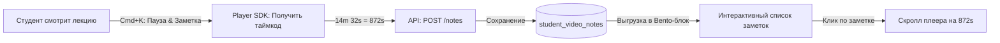

# Сквозные Видео-Заметки и Алгоритмическая Система Интервального Повторения SM2

Этот документ описывает техническое проектирование двух передовых прикладных систем повышения эффективности обучения на платформе **MathalamaEdu**: сквозных видео-заметок, жестко привязанных к таймкодам лекций, и адаптивного тренажера интервального повторения сложных вопросов на базе математической модели **SuperMemo-2 (SM2)**.

---

## 1. Сквозные Видео-Заметки и Закладки (Timestamped Video Notes)

Студенты могут делать личные конспекты и ставить закладки прямо во время просмотра видеолекций. Каждая заметка сохраняется с точным таймкодом видео, позволяя в один клик перематывать лекцию на нужный момент.



### 1.1. Модель данных PostgreSQL (DDL)
```sql
CREATE TABLE student_video_notes (
    id UUID PRIMARY KEY DEFAULT uuid_generate_v4(),
    student_id UUID NOT NULL,
    lesson_id UUID NOT NULL REFERENCES lessons(id) ON DELETE CASCADE,
    video_timestamp_seconds INT NOT NULL, -- Секунда видео, к которой привязана заметка
    note_text TEXT NOT NULL,              -- Текст конспекта
    created_at TIMESTAMP WITH TIME ZONE NOT NULL DEFAULT CURRENT_TIMESTAMP,
    updated_at TIMESTAMP WITH TIME ZONE NOT NULL DEFAULT CURRENT_TIMESTAMP
);

CREATE INDEX idx_student_lesson_notes ON student_video_notes(student_id, lesson_id);
```

---

### 1.2. Интерактивный React-компонент конспектирования (Next.js)
React-компонент интегрируется с Vimeo/Kinoscope Player API, перехватывает сочетание клавиш `Cmd+K` (или `Ctrl+K`) для автоматической паузы плеера и открытия формы ввода заметки на текущем таймкоде:

```tsx
import React, { useState, useEffect, useRef } from 'react';
import Player from '@vimeo/player';

interface Note {
  id: string;
  video_timestamp_seconds: number;
  note_text: string;
}

interface VideoNotesManagerProps {
  lessonId: string;
  videoId: string;
}

export const VideoNotesManager: React.FC<VideoNotesManagerProps> = ({ lessonId, videoId }) => {
  const iframeRef = useRef<HTMLIFrameElement>(null);
  const [player, setPlayer] = useState<Player | null>(null);
  const [notes, setNotes] = useState<Note[]>([]);
  const [noteText, setNoteText] = useState('');
  const [isModalOpen, setIsModalOpen] = useState(false);
  const [currentSec, setCurrentSec] = useState(0);

  useEffect(() => {
    if (!iframeRef.current) return;
    const vimeoPlayer = new Player(iframeRef.current);
    setPlayer(vimeoPlayer);

    // Загрузка существующих заметок урока
    fetch(`/api/v1/student/lessons/${lessonId}/notes`)
      .then(res => res.json())
      .then(data => setNotes(data))
      .catch(console.error);

    // Обработчик горячих клавиш: Cmd+K / Ctrl+K для создания заметки
    const handleKeyDown = async (e: KeyboardEvent) => {
      if ((e.metaKey || e.ctrlKey) && e.key.toLowerCase() === 'k') {
        e.preventDefault();
        await vimeoPlayer.pause();
        const seconds = await vimeoPlayer.getCurrentTime();
        setCurrentSec(Math.floor(seconds));
        setIsModalOpen(true);
      }
    };

    window.addEventListener('keydown', handleKeyDown);
    return () => window.removeEventListener('keydown', handleKeyDown);
  }, [lessonId]);

  // Перемотка видео на нужную секунду при клике на таймкод
  const handleSeek = async (seconds: number) => {
    if (player) {
      await player.setCurrentTime(seconds);
      await player.play();
    }
  };

  const handleSaveNote = async () => {
    if (!noteText.trim()) return;

    try {
      const res = await fetch('/api/v1/student/notes', {
        method: 'POST',
        headers: {
          'Content-Type': 'application/json',
          'Authorization': `Bearer ${localStorage.getItem('token')}`
        },
        body: JSON.stringify({
          lesson_id: lessonId,
          video_timestamp_seconds: currentSec,
          note_text: noteText
        })
      });

      const newNote = await res.json();
      setNotes(prev => [...prev, newNote].sort((a, b) => a.video_timestamp_seconds - b.video_timestamp_seconds));
      setNoteText('');
      setIsModalOpen(false);
      if (player) await player.play();
    } catch (err) {
      console.error(err);
    }
  };

  const formatTime = (sec: number) => {
    const mins = Math.floor(sec / 60);
    const secs = sec % 60;
    return `${mins}:${secs < 10 ? '0' : ''}${secs}`;
  };

  return (
    <div class="grid grid-cols-3 gap-6">
      {/* Левая панель: Видеоплеер (Bento-карточка 1) */}
      <div class="col-span-2 bg-white border border-zinc-200 rounded-3xl p-6 shadow-sm">
        <div class="relative w-full aspect-video rounded-2xl overflow-hidden bg-black">
          <iframe
            ref={iframeRef}
            src={`https://player.vimeo.com/video/${videoId}`}
            class="absolute top-0 left-0 w-full h-full"
            frameBorder="0"
            allow="autoplay; fullscreen"
            allowFullScreen
          ></iframe>
        </div>
        <p class="text-xs text-zinc-400 mt-2">
          Нажмите <kbd class="px-1.5 py-0.5 bg-zinc-100 border rounded text-zinc-600 font-sans">Cmd + K</kbd> для паузы и создания быстрой заметки на текущей секунде.
        </p>
      </div>

      {/* Правая панель: Личные заметки лекции (Bento-карточка 2) */}
      <div class="col-span-1 bg-white border border-zinc-200 rounded-3xl p-6 shadow-sm flex flex-col h-[400px]">
        <h3 class="text-lg font-bold text-zinc-900 mb-4">Мой конспект</h3>
        <div class="flex-1 overflow-y-auto space-y-3 pr-2">
          {notes.length === 0 ? (
            <p class="text-sm text-zinc-400 text-center mt-12">У вас пока нет заметок. Сделайте первую на важном моменте видео!</p>
          ) : (
            notes.map(note => (
              <div key={note.id} class="p-3 bg-zinc-50 rounded-xl border border-zinc-100 flex flex-col space-y-1">
                <button
                  onClick={() => handleSeek(note.video_timestamp_seconds)}
                  class="self-start text-xs font-semibold text-blue-600 hover:underline"
                >
                  Таймкод: {formatTime(note.video_timestamp_seconds)}
                </button>
                <p class="text-sm text-zinc-700">{note.note_text}</p>
              </div>
            ))
          )}
        </div>
      </div>

      {/* Модальное окно создания заметки */}
      {isModalOpen && (
        <div class="fixed inset-0 bg-black/30 backdrop-blur-sm flex items-center justify-center z-50">
          <div class="bg-white border border-zinc-200 rounded-3xl p-6 max-w-md w-full shadow-lg">
            <h4 class="text-base font-bold text-zinc-900 mb-2">Новая заметка на {formatTime(currentSec)}</h4>
            <textarea
              value={noteText}
              onChange={e => setNoteText(e.target.value)}
              placeholder="Введите текст заметки..."
              rows={4}
              class="w-full border border-zinc-200 rounded-xl p-3 text-sm focus:outline-none focus:border-blue-600"
            ></textarea>
            <div class="flex justify-end space-x-3 mt-4">
              <button
                onClick={() => { setIsModalOpen(false); player?.play(); }}
                class="px-4 py-2 text-sm text-zinc-500 hover:text-zinc-700"
              >
                Отмена
              </button>
              <button
                onClick={handleSaveNote}
                class="px-4 py-2 text-sm bg-blue-600 hover:bg-blue-700 text-white font-medium rounded-xl"
              >
                Сохранить
              </button>
            </div>
          </div>
        </div>
      )}
    </div>
  );
};
```

---

## 2. Адаптивная Система Интервального Повторения (Spaced Repetition Engine)

Система отслеживает ошибки студентов на тестах и формирует индивидуальную очередь повторения вопросов на основе **алгоритма SuperMemo-2 (SM2)**. Это оптимизирует усвоение сложных формул и теорем.

### 2.1. Математическая модель алгоритма SM2
Для каждого сложного вопроса рассчитываются три параметра:
1.  **`Repetitions` (Повторения):** Количество успешных последовательных ответов на вопрос.
2.  **`Easiness Factor` (Коэффициент легкости, EF):** Мягко адаптирует интервал. Дефолтное значение: `2.5`. Минимальное значение: `1.3`.
3.  **`Interval` (Интервал, I):** Количество дней до следующего показа вопроса студенту.

После каждого ответа студент получает оценку качества `Quality` (от 0 — «совсем забыл» до 5 — «идеально помню»). В системе MathalamaEdu оценки сопоставляются автоматически:
*   Неверный ответ на тест $\rightarrow$ `Quality = 1`.
*   Верный ответ с 3-й попытки $\rightarrow$ `Quality = 3`.
*   Верный ответ с 1-й попытки $\rightarrow$ `Quality = 5`.

#### Формула расчета нового интервала ($I$):
$$I(1) = 1$$
$$I(2) = 6$$
$$I(n) = I(n-1) \times EF, \quad \text{при } n > 2$$

Если оценка неудовлетворительная (`Quality < 3`), количество повторений сбрасывается в `0`, а интервал — в `1 день`.

#### Формула адаптации коэффициента легкости ($EF'$):
$$EF' = EF + (0.1 - (5 - q) \times (0.08 + (5 - q) \times 0.02))$$
где $q$ — оценка качества (Quality 0-5). Если $EF' < 1.3$, устанавливается $EF' = 1.3$.

---

### 2.2. Модель данных PostgreSQL (DDL)
```sql
CREATE TABLE student_spaced_repetition (
    id UUID PRIMARY KEY DEFAULT uuid_generate_v4(),
    student_id UUID NOT NULL,
    question_id UUID NOT NULL,            -- ID вопроса из банка вопросов
    repetitions INT NOT NULL DEFAULT 0,  -- Число успешных повторений подряд
    interval_days INT NOT NULL DEFAULT 0, -- Текущий интервал в днях до показа
    easiness_factor NUMERIC(4,2) NOT NULL DEFAULT 2.50, -- Коэффициент легкости EF
    next_review_date DATE NOT NULL DEFAULT CURRENT_DATE, -- День следующего показа
    last_reviewed_at TIMESTAMP WITH TIME ZONE,
    created_at TIMESTAMP WITH TIME ZONE NOT NULL DEFAULT CURRENT_TIMESTAMP
);

CREATE UNIQUE INDEX idx_student_question_rep ON student_spaced_repetition(student_id, question_id);
CREATE INDEX idx_student_review_date ON student_spaced_repetition(student_id, next_review_date);
```

---

### 2.3. Go-Реализация ядра алгоритма SM2
Чистая доменная функция на Go, рассчитывающая параметры следующего повторения:

```go
package domain

import (
	"math"
	"time"
)

type SpacedRepetitionItem struct {
	StudentID      string
	QuestionID     string
	Repetitions    int
	IntervalDays   int
	EasinessFactor float64
	NextReviewDate time.Time
}

// CalculateNextReview выполняет расчет параметров по алгоритму SuperMemo-2 (SM2)
func CalculateNextReview(item SpacedRepetitionItem, quality int) SpacedRepetitionItem {
	// 1. Обработка забывания (Quality < 3)
	if quality < 3 {
		item.Repetitions = 0
		item.IntervalDays = 1
		// Корректируем коэффициент легкости EF даже при ошибках
		item.EasinessFactor = calculateNewEF(item.EasinessFactor, quality)
		item.NextReviewDate = time.Now().AddDate(0, 0, 1)
		return item
	}

	// 2. Расчет интервала для успешных ответов
	if item.Repetitions == 0 {
		item.IntervalDays = 1
	} else if item.Repetitions == 1 {
		item.IntervalDays = 6
	} else {
		// I(n) = I(n-1) * EF
		newInterval := float64(item.IntervalDays) * item.EasinessFactor
		item.IntervalDays = int(math.Round(newInterval))
	}

	item.Repetitions++
	item.EasinessFactor = calculateNewEF(item.EasinessFactor, quality)
	item.NextReviewDate = time.Now().AddDate(0, 0, item.IntervalDays)

	return item
}

func calculateNewEF(ef float64, quality int) float64 {
	q := float64(quality)
	// Формула: EF' = EF + (0.1 - (5 - q) * (0.08 + (5 - q) * 0.02))
	newEF := ef + (0.1 - (5.0-q)*(0.08+(5.0-q)*0.02))
	
	if newEF < 1.3 {
		return 1.3 // Нижний предел EF по стандарту SM2
	}
	
	// Округляем до 2 знаков после запятой
	return math.Round(newEF*100) / 100
}
```

---

### 2.4. Спецификация REST API «Ежедневная разминка» (Review Queue)

*   **Получить 5 карточек на сегодня (GET /api/v1/student/review-queue):**
    *   *Описание:* Извлекает вопросы, запланированные к повторению на текущую дату (`next_review_date <= CURRENT_DATE`), лимитируя выдачу 5 вопросами для предотвращения утомления студента.
    *   *Response (200 OK):*
        ```json
        {
          "queue_length": 14,
          "questions": [
            {
              "id": "question-uuid-777",
              "text": "Найдите предел lim (x->0) sin(x)/x",
              "options": ["0", "1", "бесконечность", "не существует"],
              "lesson_id": "lesson-uuid-abc"
            }
          ]
        }
        ```

*   **Отправить ответ на карточку (POST /api/v1/student/review-queue/submit):**
    *   *Request Payload:*
        ```json
        {
          "question_id": "question-uuid-777",
          "chosen_option": "1"
        }
        ```
    *   *Response (200 OK):*
        ```json
        {
          "is_correct": true,
          "correct_option": "1",
          "xp_earned": 15,
          "next_review_in_days": 6
        }
        ```
        *Внутренняя логика:* Бэкенд проверяет ответ. Если ответ верен с 1-й попытки, вызывает `CalculateNextReview(item, 5)` и начисляет +15 XP. Если ответ неверен, вызывает `CalculateNextReview(item, 1)`, оставляет вопрос в очереди и начисляет 0 XP.
