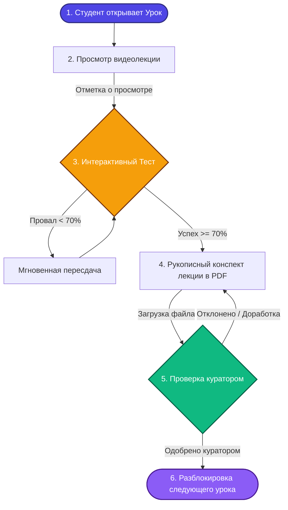
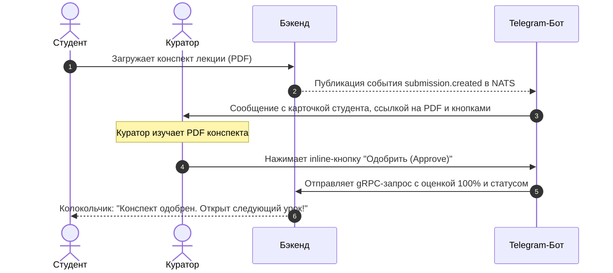
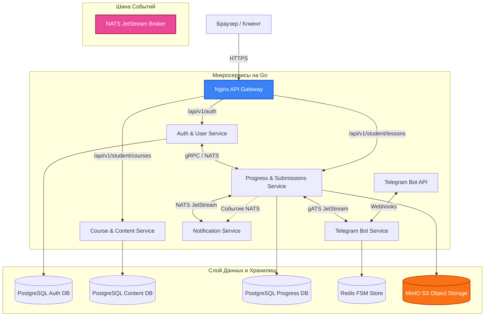
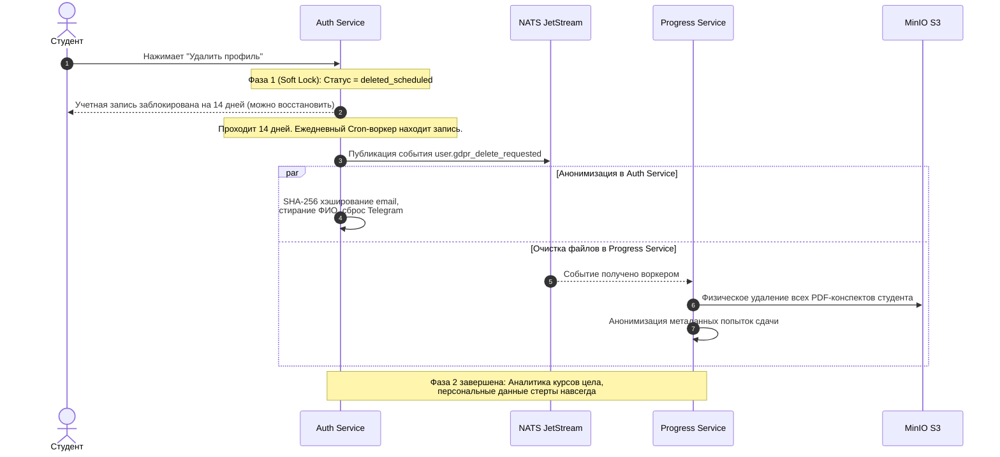
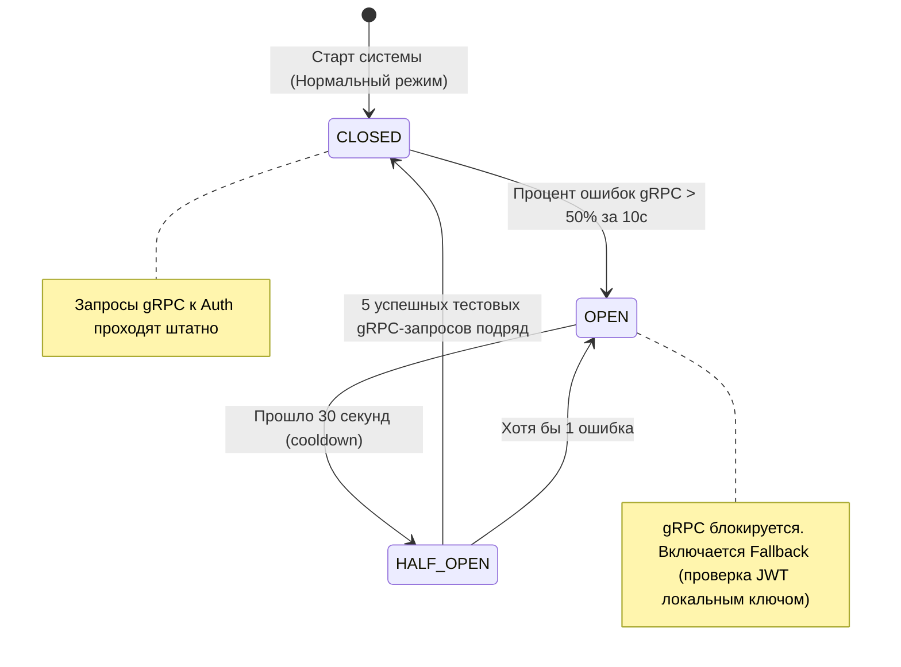

# MathalamaEdu: Событийно-Ориентированный Конвейер Обучения (Event-Driven LMS)

**MathalamaEdu** — это высоконагруженная, событийно-ориентированная онлайн-платформа для интерактивного обучения математике, спроектированная как современная, сфокусированная альтернатива перегруженным системам вроде GetCourse. Платформа полностью очищена от маркетингового шума, ворон продаж и ориентирована на европейский рынок с жестким соблюдением приватности (GDPR Compliance).

---

## 1. Продуктовая концепция: Гибридный конвейер обучения

Каждый урок представляет собой комплексную цепочку последовательного прохождения на одной странице. Студент продвигается вперед по принципу **Content Dripping** (последовательного капельного доступа).

### Визуальный флоу прохождения урока студентом:


### Роли и возможности на платформе:

| Возможности / Роли | Студент (Student) | Куратор (Curator) | Администратор (Admin) |
| :--- | :---: | :---: | :---: |
| **Доступ к курсам** | Только своя когорта | Только закрепленная группа | Полный доступ |
| **Прогресс уроков** | Последовательный (Dripping) | Просмотр успеваемости группы | Управление структурой |
| **Интерактивные тесты** | Бесконечные мгновенные попытки | Просмотр истории попыток | Импорт вопросов из JSON |
| **Проверка конспектов** | Сдача PDF-файлов | Оценивание (0-100%) + Фидбек | Назначение кураторов |
| **Интеграция с Telegram** | — | Управление проверкой одной кнопкой | — |
| **GDPR Удаление аккаунта**| Самостоятельно в 1 клик | — | — |

---

## 2. Быстрое управление куратора через Telegram-бота

Для кураторов реализован интерактивный бот **`MathalamaEduBot`**, позволяющий проверять работы в реальном времени прямо с мобильного телефона без входа на сайт платформы.



---

## 3. Микросервисная архитектура системы

Платформа спроектирована как децентрализованное облако независимых микросервисов на Go, взаимодействующих асинхронно через шину событий **NATS JetStream** и синхронно по высокопроизводительному протоколу **gRPC**.



---

## 4. Двухфазный конвейер GDPR-Анонимизации (Право на забвение)

Для полного соответствия европейскому законодательству GDPR, удаление аккаунта студента происходит в два этапа, защищая базу данных от разрушения аналитических связей.



---

## 5. Паттерны отказоустойчивости и надежности

Для предотвращения каскадных сбоев при синхронном общении микросервисов на gRPC-клиентах реализован паттерн **Circuit Breaker** (Предохранитель) с криптографическим локальным резервом (Fallback).



> [!NOTE]
> **Локальный Fallback:** Если `Auth & User Service` недоступен (Circuit Breaker в состоянии `OPEN`), `Progress Service` временно переходит на локальную криптографическую проверку JWT-токена студента с помощью общего `JWT_SECRET`. Студент может продолжать просматривать теорию и видео, но операции записи блокируются до восстановления связи.

---

## 6. Гексагональная структура Go-микросервиса (Clean Architecture)

Вся кодовая база микросервисов MathalamaEdu пишется строго в соответствии с принципами чистой архитектуры. Бизнес-логика полностью отделена от внешних драйверов СУБД, HTTP и gRPC фреймворков.

```
internal/
├── domain/             # Слои сущностей (Entities). Чистые структуры Go (errors.go, user.go)
├── usecase/            # Бизнес-логика (Use Cases). Чистые алгоритмы, порты (interfaces.go)
├── repository/         # Адаптеры баз данных. Реализация SQL запросов (PgTxManager, PostgresRepo)
└── delivery/           # Внешние адаптеры ввода-вывода (HTTP-хэндлеры, gRPC-сервер, NATS-воркеры)
```

### Ключевые паттерны в коде:
*   **Fail-Fast Config:** Микросервис мгновенно падает при запуске с информативным логом, если в `.env` отсутствует обязательная настройка или допущен невалидный формат порта.
*   **TxManager в context.Context:** Управление SQL-транзакциями вынесено на слой бизнес-логики (`usecase`), при этом логика остается полностью чистой от импортов SQL-пакетов благодаря передаче транзакции в контексте.
*   **Nak/DLQ в NATS:** Фоновые очереди разделяют ошибки на временные (перевызов через `msg.Nak()`) и фатальные (сброс в Dead Letter Queue для ручного анализа с вызовом `msg.Ack()`).
